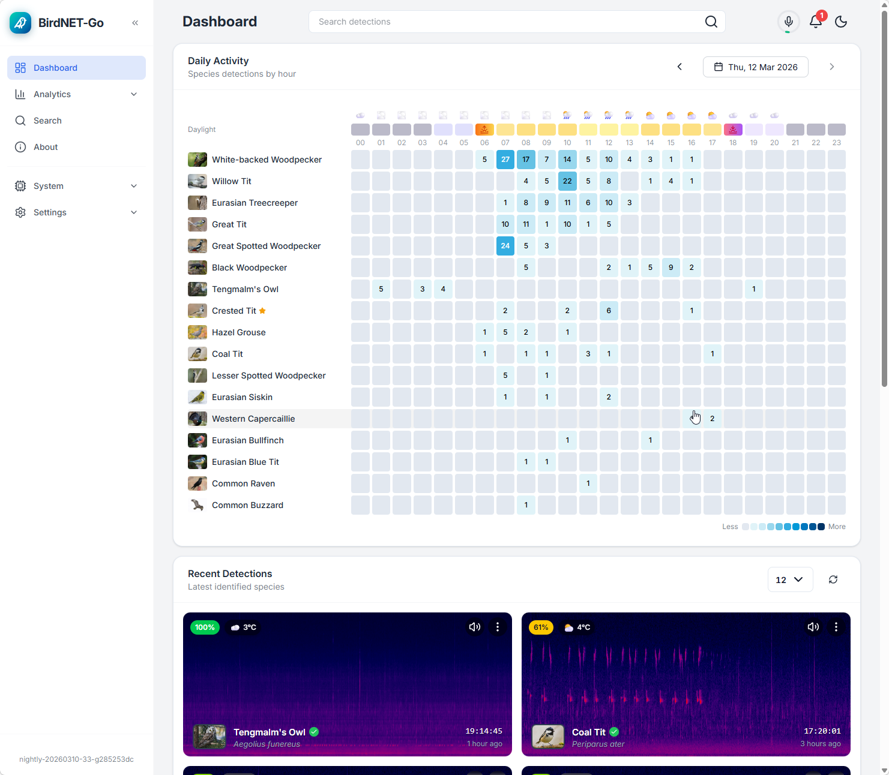

# BirdNET-Go

<p align="center">
  
</p>
<p align="center">
<a href="https://creativecommons.org/licenses/by-nc-sa/4.0/">
 
 </a>
 
</p>

BirdNET-Go is an AI solution for continuous avian monitoring and identification

- 24/7 realtime bird song analysis of soundcard capture, analysis output to log file, SQLite or MySQL
- Utilizes BirdNET AI model trained with more than 6500 bird species
- Local processing, Internet connectivity not required
- Easy to use Web user interface for data visualisation
- BirdWeather.com API integration
- Realtime log file output can be used as overlay in OBS for bird feeder streams etc.
- Minimal runtime dependencies, BirdNET Tensorflow Lite model is embedded in compiled binary
- Runs on Windows, Linux and macOS
- Low resource usage, works on Raspberry Pi 3 and equivalent 64-bit single board computers

## Help Improve BirdNET-Go

I am seeking web developer with experience in Go HTML templating, Tailwind CSS, HTMX, Alpine.js, or
similar frameworks to join in enhancing the BirdNET-Go application web UI. Your expertise can make
a real difference in how users engage with this app and connect with birdlife. If you have the
skills and a keen interest in contributing to a nature-focused project, I'd love to hear from you.

## Web Dashboard



## Executable Distributions

Ready to run binaries can be found from releases section https://github.com/tphakala/BirdNET-Go/releases/
Archives also contains libtensorflowlite_c library.

### Docker

```
docker run -ti \
  -p 8080:8080 \
  --env ALSA_CARD=<index/name>
  --device /dev/snd \
  -v /path/to/config:/config \
  -v /path/to/data:/data \
  ghcr.io/tphakala/birdnet-go:latest
```

| Parameter | Function |
| :----: | --- |
| `-p 8080` | BirdNET-GO webserver port. |
| `--env ALSA_CARD=<index/name>` | ALSA capture device to use. Find index/name of desired device by executing `arecord -l` on the host. [More info.](#deciding-alsa-card)|
| `--device /dev/snd` | Mounts in audio devices to the container. |
| `-v /config` | Config directory in the container. |
| `-v /data` | Data such as database and recordings. |


#### Deciding ALSA_CARD value

Within the BirdNET-Go container, knowledge of the designated microphone is absent. Consequently, it is necessary to specify the appropriate ALSA_CARD environment variable. Determining the correct value for this variable involves the following steps on the host computer:
1. Open a terminal and execute the command `arecord -l` to list all available capture devices.

```
> arecord -l
**** List of CAPTURE Hardware Devices ****
card 0: PCH [Generic Analog], device 0: Analog [Analog]
  Subdevices: 1/1
  Subdevice #0: subdevice #0
card 0: PCH [Generic Analog], device 2: Alt Analog [Alt Analog]
  Subdevices: 1/1
  Subdevice #0: subdevice #0
card 1: Microphone [USB Microphone], device 0: USB Audio [USB Audio]
  Subdevices: 1/1
  Subdevice #0: subdevice #0
```
2. Identify the desired capture device. In the example above, cards 0 and 1 are available.
3. Specify the ALSA_CARD value when running the BirdNET-Go container. For instance, if the USB Microphone device is chosen, set `ALSA_CARD` to either `ALSA_CARD=1` or `ALSA_CARD=Microphone`.

## Compiling for Linux

### Install TensorFlow Lite C library and setup headers for compile process

Download precompiled TensorFlow Lite C library for Linux from https://github.com/tphakala/tflite_c/releases/tag/v2.14.0

Copy libtensorflowlite_c.so to /usr/local/lib and run ```ldconfig```

```bash
sudo cp libtensorflowlite_c.so /usr/local/lib
sudo ldconfig
```

Clone tensorflow repository, this is required for header files to be present while compiling with CGO

```bash
mkdir ~/src
cd ~/src
git clone https://github.com/tensorflow/tensorflow.git
```

Checkout TensorFlow v2.14.0 release

```bash
cd tensorflow
git checkout tags/v2.14.0
```

### Building BirdNET-Go

Clone BirdNET-Go repository

```bash
git clone https://github.com/tphakala/BirdNET-Go.git
```

Build BirdNET-Go by make, compiled binary will be placed in go-birdnet/bin directory

```bash
cd BirdNET-Go
make
```

## Compiling for Windows

Windows build is cross compiled on Linux, for this you need MinGW-w64 on your build system

```bash
  sudo apt install mingw-w64-tools gcc-mingw-w64-x86-64 gcc-mingw-w64-i686
```

Download precompiled TensorFlow Lite C library for Windows from https://github.com/tphakala/tflite_c/releases/tag/v2.14.0

Copy **libtensorflowlite_c.dll** to /usr/x86_64-w64-mingw32/lib/

```bash
sudo cp libtensorflowlite_c.dll /usr/x86_64-w64-mingw32/lib/
```

Clone tensorflow repository, this is required for header files to be present while compiling with CGO

```bash
mkdir ~/src
cd ~/src
git clone https://github.com/tensorflow/tensorflow.git
```

### Cross compiling BirdNET-Go

Clone BirdNET-Go repository

```bash
git clone https://github.com/tphakala/BirdNET-Go.git
```

Build BirdNET-Go by running make windows

```bash
cd BirdNET-Go
make windows
```

Windows executable is in **bin/birdnet.exe**, copy this and **libtensorflowlite_c.so** to your Windows system, library file must be in PATH for birdnet.exe to run properly.

Yes it is correct that you need **libtensorflowlite_c.dll** in /usr/x86_64-w64-mingw32/lib/ for compile process, and on Windows you need **libtensorflowlite_c.so** for runtime. This sounds backwards but this is how it works.

## Usage

```bash
BirdNET-Go CLI

Usage:
  birdnet [command]

Available Commands:
  authors     Print the list of authors
  completion  Generate the autocompletion script for the specified shell
  directory   Analyze all *.wav files in a directory
  file        Analyze an audio file
  help        Help about any command
  license     Print the license of Go-BirdNET
  realtime    Analyze audio in realtime mode

Flags:
      --debug               Enable debug output
  -h, --help                help for birdnet
      --locale string       Set the locale for labels. Accepts full name or 2-letter code. (default "finnish")
      --overlap float       Overlap value between 0.0 and 2.9
      --sensitivity float   Sigmoid sensitivity value between 0.0 and 1.5 (default 1)
      --threshold float     Confidency threshold for detections, value between 0.1 to 1.0 (default 0.8)

Use "birdnet [command] --help" for more information about a command.
```

There is more detailed usage documentation at wiki https://github.com/tphakala/birdnet-go/wiki

## License

Creative Commons Attribution-NonCommercial-ShareAlike 4.0 International

## Authors

Tomi P. Hakala

BirdNET AI model by the K. Lisa Yang Center for Conservation Bioacoustics at the Cornell Lab of Ornithology in collaboration with Chemnitz University of Technology. Stefan Kahl, Connor Wood, Maximilian Eibl, Holger Klinck.

BirdNET label translations by Patrick Levin for BirdNET-Pi project by Patrick McGuire.
