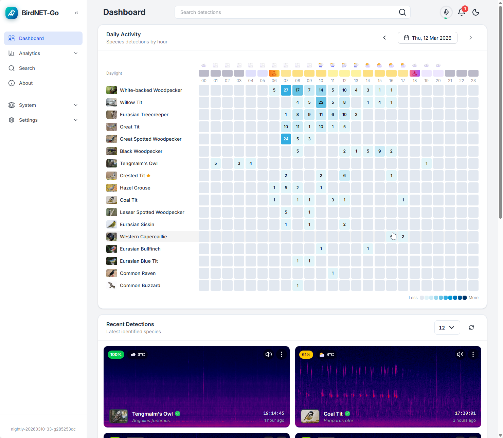

# BirdNET-Go

<p align="center">
  
</p>
<p align="center">
  <!-- Project Status -->
  <a href="https://github.com/tphakala/birdnet-go/releases">
    
  </a>
  <a href="https://creativecommons.org/licenses/by-nc-sa/4.0/">
    
  </a>
  

  <br>

  <!-- Code Quality -->
  <a href="https://golang.org">
    
  </a>
  <a href="https://goreportcard.com/report/github.com/tphakala/birdnet-go">
    
  </a>

  <br>

  <!-- Community -->
  <a href="https://github.com/tphakala/birdnet-go/network/members">
    
  <a href="https://github.com/tphakala/birdnet-go/graphs/contributors">
    
  </a>
  </a>
  <a href="https://github.com/tphakala/birdnet-go/issues">
    
  </a>
  <a href="https://discord.gg/gcSCFGUtsd">
    
  </a>

  <a href="https://coderabbit.ai">
    
  </a>
</p>

BirdNET-Go is a self-hosted 24/7 bird (and bat) sound monitor. It runs AI classifiers locally against your soundcard or RTSP streams, stores detections in SQLite or MySQL, and presents them in a fast web UI. No cloud required, runs on a Raspberry Pi.

## Highlights

- **Multi-model AI gallery**: install BirdNET v2.4, Google Perch v2, BattyBirdNET regional bat classifiers, and the BirdNET Geomodel v3.0 from inside the app, no rebuild needed.
- **Run multiple models in parallel** against separate audio sources and let cross-model agreement boost confidence on shared detections.
- **Live spectrogram streaming** and **detection heatmaps** rendered straight in the browser.
- **Alert rules engine** that routes detections to Discord, Slack, Telegram, ntfy, Pushover, Gotify, Matrix, webhooks, browser push, MQTT (with Home Assistant discovery), shell scripts, and BirdWeather.
- **Production-ready ops**: onboarding wizard, OIDC/SSO, TLS certificate management, hot-reload settings, system health page, database doctor, and one-click support dumps.
- **Installable as a PWA**, with 15 UI languages and species names in 40+ languages.
- **Local-only by default**. Optional Sentry telemetry is strictly opt-in.

## Quick install

Debian, Ubuntu, and Raspberry Pi OS:

```bash
curl -fsSL https://github.com/tphakala/birdnet-go/raw/main/install.sh -o install.sh
bash ./install.sh
```

Docker images are published for `linux/amd64` and `linux/arm64`. Pre-built binaries for Linux, Windows, and macOS ship with each [release](https://github.com/tphakala/birdnet-go/releases). See the [installation guide](doc/wiki/installation.md), [hardware recommendations](doc/wiki/hardware.md), and [security guide](doc/wiki/security.md) for details.

## Web Dashboard



## Features

### Detection

- **BirdNET v2.4** (default, embedded, 6,500+ bird species)
- **Google Perch v2** via ONNX (14,795 species across birds, insects, amphibians, and mammals) with taxonomy-based species names
- **BattyBirdNET** bat classifiers, 11 regional models covering Africa, the Americas, East Asia, Europe, the Middle East, South Asia, Southeast Asia, and the USA (Linux + ultrasonic-capable device)
- **BirdNET Geomodel v3.0** for location-based range filtering (12,012 species)
- **Cross-model detection consensus**: agreement between models strengthens confidence and flags disagreements for review
- **Custom classifiers**: bring your own TFLite model and label set
- **Configurable false-positive filtering** for accurate results: Deep Detection (repeat-confirmation within a 15-second window), per-species dynamic thresholds, location-based range filter, privacy and dog-bark filters, and per-classifier bat false-positive levels ([guide](doc/wiki/guide.md#deep-detection))
- Per-model and per-source confidence thresholds

### Audio inputs

- Soundcard capture and RTSP / RTSPS streams, including multiple sources in parallel with independent model assignment
- Sample rates up to 256 kHz for ultrasonic bat detection
- Audio liveness watchdog with tiered recovery for flaky streams
- Stream sample-rate probing and per-model recommendation banners in the UI
- Audio equalizer, per-source quiet hours, daylight filter, and extended capture mode
- Offline analysis of audio files

### Interface

- Svelte 5 + TypeScript single-page app
- Installable as a Progressive Web App (PWA)
- Onboarding wizard for first-run setup
- Live spectrogram visualization for active streams ([live audio streaming](doc/wiki/guide.md#live-audio-streaming))
- Detection heatmaps with ONNX-accelerated rendering
- Customizable dashboard layout, color schemes, and a "Currently Hearing" card
- Multiselect and bulk actions on the detections list
- Browser terminal (xterm.js over WebSocket PTY) for in-app administration
- 15 UI languages: English, German, French, Spanish, Portuguese, Dutch, Polish, Italian, Czech, Slovak, Hungarian, Finnish, Swedish, Danish, Latvian
- Species names in 40+ languages

### Alerts and integrations

- Configurable alert rules engine with per-rule conditions, schedules, and delivery targets
- Multi-target delivery via [shoutrrr](https://github.com/nicholas-fedor/shoutrrr): Discord, Slack, Telegram, ntfy, Pushover, Gotify, Matrix, Bark, IFTTT, and more
- Webhooks with custom templates, shell-script hooks, and browser push notifications
- MQTT publishing with Home Assistant auto-discovery
- BirdWeather.com API integration
- Prometheus metrics endpoint
- Live spectrogram and realtime log output for OBS overlays on bird-feeder streams

### Storage and data

- SQLite (default) or MySQL with retry-aware write paths for contention
- Automatic backups with real-time status polling
- Format-aware audio clip export
- Embedded eBird/Clements taxonomy (2,374 genera, 254 families, 11,145 species) for fast offline lookups

### Operations

- System Health diagnostics page covering audio pipeline, models and inference, network, and the datastore
- Database doctor for diagnosis and schema repair
- Help & Support page with guided bug reporting and one-click support dumps
- OIDC / SSO with Google, GitHub, and generic providers, including RP-Initiated Logout
- TLS certificate management UI with transactional writes and backup/restore
- Hot-reload for settings, model installs, and per-source model assignments (no restart)
- Optional, opt-in Sentry telemetry with strict privacy filtering

### Platform

- Linux, Windows, and macOS
- Single static binary with the BirdNET TFLite model embedded
- Optional ONNX Runtime for Perch, BattyBirdNET, and BirdNET Geomodel v3.0 ([install guide](doc/ONNX-Runtime-Installation.md))
- Multi-arch Docker images
- Runs comfortably on a Raspberry Pi 4 or equivalent 64-bit single-board computer

## Documentation

- [User guide](doc/wiki/guide.md)
- [Installation](doc/wiki/installation.md)
- [Hardware recommendations](doc/wiki/hardware.md)
- [Security](doc/wiki/security.md)
- [Telemetry and privacy](doc/wiki/telemetry-privacy.md)
- [Cloudflare Tunnel](doc/wiki/cloudflare_tunnel_guide.md)
- [RTSP troubleshooting](doc/wiki/rtsp-troubleshooting.md)
- [Training a custom classifier](doc/wiki/training-a-custom-classifier.md)

## Development setup

> See [CONTRIBUTING.md](CONTRIBUTING.md) for the full guide.

```bash
git clone https://github.com/tphakala/birdnet-go.git
cd birdnet-go

# Install Task (if not already installed)
# Linux: sh -c "$(curl --location https://taskfile.dev/install.sh)" -- -d -b /usr/local/bin
# macOS: brew install go-task

task setup-dev    # installs Go 1.25, Node LTS, build tools, linters, Playwright
task              # build
task dev_server   # hot-reload dev server (or: air realtime)
```

## Community

Join the [Discord server](https://discord.gg/gcSCFGUtsd) for support, discussions, and updates.

## Related projects

### Core and extensions

- [BirdNET-Analyzer](https://github.com/birdnet-team/BirdNET-Analyzer): upstream BirdNET project
- [BirdNET-Go Classifiers](https://github.com/tphakala/birdnet-go-classifiers): enhanced BirdNET classifiers with additional species
- [BattyBirdNET-Analyzer](https://github.com/rdz-oss/BattyBirdNET-Analyzer): bat classifier models, installable via the in-app gallery

### Companion tools

- [birda](https://github.com/tphakala/birda): fast CLI for offline bird species detection on existing audio files, using BirdNET and Perch AI models
- [birda-gui](https://github.com/tphakala/birda-gui): desktop GUI for birda (Electron + Svelte 5) for audio analysis, detection browsing, and species visualization

### System integration

- [Cockpit BirdNET-Go](https://github.com/tphakala/cockpit-birdnet-go): web-based system management plugin using the Cockpit framework

### Migration tools

- [BirdNET-Pi2Go](https://github.com/tphakala/birdnet-pi2go): database converter for migrating from BirdNET-Pi

### Hardware solutions

- [BirdNET-Go ESP32 RTSP Microphone](https://github.com/Sukecz/birdnetgo-esp32-rtsp-mic): ESP32-based RTSP streaming microphone
- [ESP32 Audio Streamer](https://github.com/jpmurray/esp32-audio-streamer): alternative ESP32 RTSP streaming solution
- [M5Stack Atom Echo RTSP Mic](https://github.com/stedrow/birdnetgo-m5stack-atom-echo-rtsp-mic): RTSP audio server for M5Stack Atom Echo, no soldering required
- [M5Stack AtomS3 Lite PDM Mic](https://github.com/matthew73210/birdnetgo-m5stack-AtomS3-Lite-PDM-rtsp-mic): RTSP audio server with MEMS PDM microphone

### Mobile apps

- [Perch](https://github.com/arunrajiah/perch): open-source Android/iOS companion app. Connects to BirdNET-Go via the BirdWeather API. Live detection feed, audio playback, species browser, 14-day chart, and notifications for favourite species. MIT licensed.

## Contributing

Contributions are welcome.

For setup, workflow, and quality gates, see [CONTRIBUTING.md](CONTRIBUTING.md):

- [TL;DR quick start](CONTRIBUTING.md#tldr---quick-start-for-experienced-developers): 5-minute setup
- [Development workflow](CONTRIBUTING.md#development-workflow): hot reload, git hooks, testing
- [License and privacy](CONTRIBUTING.md#license-and-legal): CC BY-NC-SA 4.0, privacy by design

All contributions must follow privacy-by-design principles, the automated code-quality gates, and the CC BY-NC-SA 4.0 license terms.

## Data sources

### Taxonomy data

BirdNET-Go embeds taxonomy data derived from the eBird/Clements Checklist:

- **Source**: [eBird API v2](https://api.ebird.org/v2/ref/taxonomy/ebird)
- **Copyright**: (c) Cornell Lab of Ornithology
- **License**: used under eBird API Terms of Use for non-commercial purposes
- **Attribution**: taxonomy data powered by [eBird.org](https://ebird.org)
- **Coverage**: 2,374 genera, 254 families, 11,145 species

For more information, see the [eBird Taxonomy](https://ebird.org/science/use-ebird-data/the-ebird-taxonomy).

## License

Creative Commons Attribution-NonCommercial-ShareAlike 4.0 International.

## Authors and acknowledgements

Created and maintained by Tomi P. Hakala.

A growing list of community contributors keeps the project moving forward. The current list lives on the [GitHub contributors page](https://github.com/tphakala/birdnet-go/graphs/contributors).

The BirdNET AI model is by the K. Lisa Yang Center for Conservation Bioacoustics at the Cornell Lab of Ornithology in collaboration with Chemnitz University of Technology (Stefan Kahl, Connor Wood, Maximilian Eibl, Holger Klinck).

Google Perch v2 ONNX conversion by [Justin Chuby](https://huggingface.co/justinchuby/BirdNET-onnx). BattyBirdNET bat classifier models by [R.D. Zinck](https://github.com/rdz-oss/BattyBirdNET-Analyzer). BirdNET label translations by Patrick Levin for the BirdNET-Pi project by Patrick McGuire.
