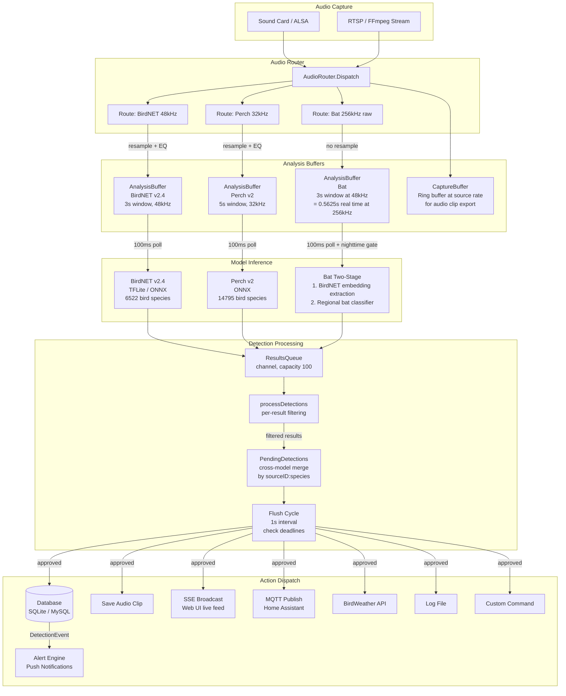
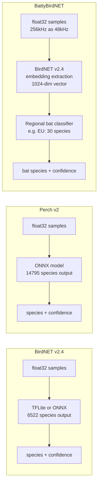
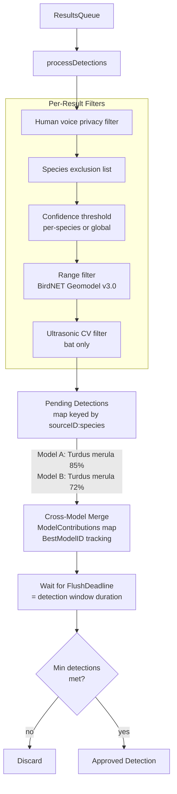
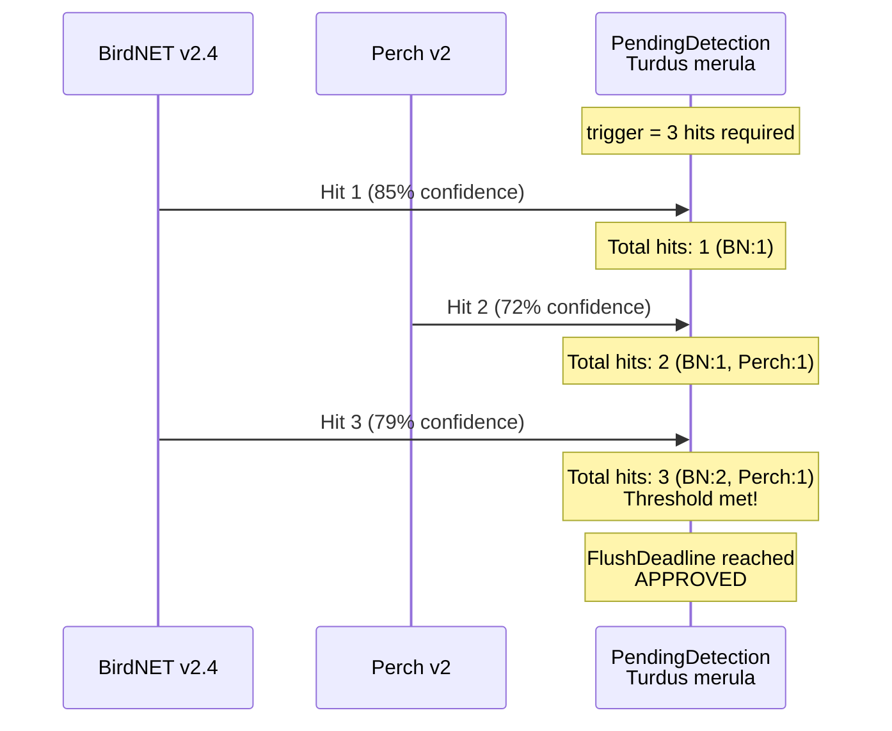
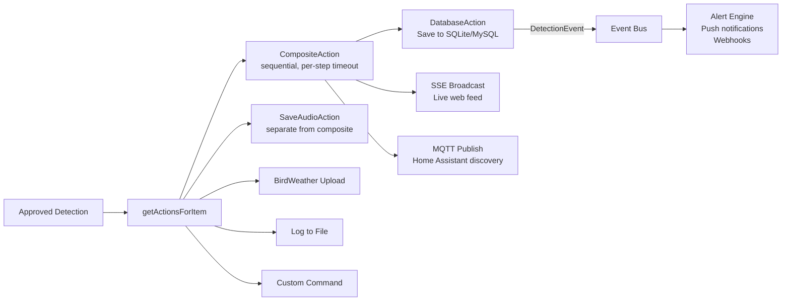
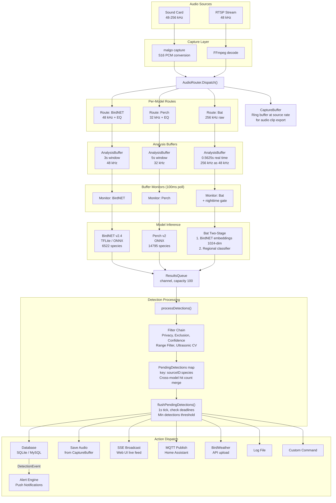

# BirdNET-Go Detection Pipeline

This document explains how audio flows through BirdNET-Go's multi-model detection pipeline, from hardware capture to stored detections and notifications.

## Pipeline Overview

## Stage 1: Audio Capture

Audio enters the system from two source types:

- **Sound cards** (via malgo/miniaudio): The `startCapture()` function opens the device and receives PCM frames in a hardware callback. Non-S16 formats (S24, S32, F32) are converted to 16-bit signed PCM. Each frame is wrapped in an `AudioFrame` with source ID, sample rate, bit depth, and timestamp.
- **RTSP streams** (via FFmpeg): An FFmpeg process decodes the network stream and produces the same `AudioFrame` type.

All frames are dispatched through the `AudioRouter`, which fans out each frame to registered routes via per-route buffered channels (capacity 64). Each route can apply gain adjustment and EQ filter chains.

### Sample Rates by Model

| Model | Inference Rate | Source Capture Rate | Resampling |
|-------|---------------|-------------------|------------|
| BirdNET v2.4 | 48 kHz | 48 kHz | None (or resample from source) |
| Perch v2 | 32 kHz | 48 kHz | Downsampled by router |
| BattyBirdNET | 48 kHz (pretend) | 96-256 kHz | None (the slow-down trick) |

## Stage 2: Buffering

Each `(source, model)` pair gets its own `AnalysisBuffer`, a lock-protected ring buffer with overlap support. The `BufferConsumer` groups model targets by rate, creates one resampler per unique target rate, and fans PCM data into the appropriate buffers.

The `CaptureBuffer` is a separate ring buffer that stores raw audio at the source sample rate. It is not used for inference; its purpose is to provide audio clip data when a detection is confirmed and needs to be saved to disk.

### The Slow-Down Trick (Bat Detection)

Bat echolocation is ultrasonic (20-120+ kHz). The BattyBirdNET system exploits a clever identity trick:

1. Audio is captured at 256 kHz from an ultrasonic microphone
2. The bat model's `ModelSpec.SampleRate` is set to 48 kHz (what BirdNET was trained on)
3. The bat model's `RawSampleRate` is set to 256 kHz (true capture rate)
4. The `BufferConsumer` routes bat audio at 256 kHz **without resampling**
5. The buffer window is sized for 3 seconds at 48 kHz (288,000 bytes)
6. At 256 kHz, 288,000 bytes covers only ~0.5625 seconds of real time
7. When BirdNET processes this data, it "sees" a 3-second clip at 48 kHz
8. Ultrasonic bat calls (e.g., 40 kHz real) appear as audible frequencies (~7.5 kHz perceived)

This is equivalent to playing a 256 kHz recording at 48 kHz speed: a ~5.3x slow-down that shifts ultrasonic calls into the audible range where BirdNET's embedding model can extract meaningful features.

## Stage 3: Model Inference

An `analysisBufferMonitor` goroutine runs for each `(sourceID, modelID)` pair, polling at 100ms intervals. When a full analysis window is available:

1. Raw PCM bytes are converted to `[][]float32`
2. `Orchestrator.PredictModel(modelID, samples)` dispatches to the correct model
3. Results are sent to the shared `ResultsQueue` channel

### Model-Specific Inference

**BirdNET v2.4**: Runs TFLite (default) or ONNX, produces 6522 species probabilities. The lightest model.

**Perch v2**: Runs ONNX, produces 14795 species probabilities. Larger model, needs more CPU and RAM.

**BattyBirdNET** (two-stage):
1. The BirdNET v2.4 ONNX model (patched to expose embeddings) extracts a 1024-dimensional embedding vector from the `GLOBAL_AVG_POOL` layer
2. A lightweight regional bat classifier (e.g., Europe, Americas) takes the embedding as input and outputs bat species probabilities
3. Results are filtered by the bat confidence threshold

### Thread Allocation

The `Orchestrator` divides the configured thread count across all loaded models proportionally. Each model entry has its own `sync.Mutex`, so inference on one model never blocks another. Dynamically loaded models (via the model gallery) receive 1 thread.

### Nighttime Scheduling

Bat models support a nighttime-only mode. When `settings.Bat.NighttimeOnly=true`, the `analysisBufferMonitor` checks `orchestrator.IsModelActive("Bat")` before calling `ProcessData()`. The nighttime scheduler uses solar position calculations to determine sunrise/sunset.

## Stage 4: Detection Processing

A single goroutine reads from `ResultsQueue` and processes each batch of results through filtering:

1. **Human voice filter**: Drops detections of human speech (privacy)
2. **Species exclusion**: Skips species on the user's ignore list
3. **Confidence threshold**: Per-species custom thresholds, or global minimum. Dynamic threshold learning adjusts over time per model.
4. **Range filter**: Location-based species filtering (see below)
5. **Ultrasonic validation** (bat only): Computes temporal variability of ultrasonic energy via STFT. Low variability flags detections as "unlikely" (ambient noise, not echolocation)

### Cross-Model Detection Consensus

Detections from different models for the **same species on the same source** are merged into a single `PendingDetection`. The key is `sourceID:commonName` (no model ID in the key).

Each pending detection tracks:
- `ModelContributions`: a map from model ID to `{HitCount, MaxConfidence, LastHitAt}`
- `BestModelID`: which model produced the single highest confidence score
- `FlushDeadline`: when to evaluate the detection for approval

Cross-model agreement strengthens confidence: hit counts from all contributing models are combined for the minimum-detections threshold check. A species detected by both BirdNET and Perch reaches the threshold faster than one detected by a single model.

### How Multiple Models Reduce False Positives

The minimum-detections threshold (`trigger` setting) is the primary false positive filter. A detection must accumulate enough hits within the detection window before it is approved. With multiple models, hit counts from all contributing models are summed.

Each `PendingDetection` stores a `ModelContributions` map tracking per-model statistics:

| Field | Purpose |
|-------|---------|
| `HitCount` | Number of analysis windows where this model detected the species |
| `MaxConfidence` | Highest single-detection confidence from this model |
| `LastHitAt` | Timestamp of the most recent hit from this model |

At flush time, the total hit count is the **sum across all models**. This means:

- **Single model**: BirdNET must produce 3 hits alone to meet a trigger of 3
- **Two models**: BirdNET (2 hits) + Perch (1 hit) = 3 total, threshold met
- **Cross-model agreement**: When both models independently identify the same species, the combined evidence is stronger, reducing false positives from single-model artifacts

The `BestModelID` field tracks which model produced the highest individual confidence score. This model is credited as the primary detector in the database record, while per-model contributions are stored separately in the `DetectionModelContribution` table.

### Range Filter (BirdNET Geomodel v3.0)

The range filter limits detections to species that are geographically plausible at the configured location and time of year.

| Model | Range Filtered? | Reason |
|-------|----------------|--------|
| BirdNET v2.4 | Always | BirdNET species are in the geomodel |
| Perch v2 | Only with BirdNET Geomodel v3.0 | v3 covers Perch's expanded label set |
| BattyBirdNET | Never | Bat species have independent range data |
| BSG | Never | Independent species set |

At startup, `BuildRangeFilter()` runs `PredictSpeciesScores(lat, lon, week, threshold)` on the geomodel to build a list of included species. Per-detection, `shouldFilterDetection()` checks `settings.IsSpeciesIncluded(species)` for applicable models.

## Stage 5: Action Dispatch

When a pending detection's flush deadline arrives and it passes the minimum-detections check, it becomes an approved detection. The processor builds a list of actions and enqueues each as a `Task` on the `JobQueue`.

**CompositeAction** wraps Database, SSE, and MQTT as sequential steps. `SaveAudioAction` runs separately to avoid slow FFmpeg encoding blocking the real-time broadcast.

### Audio Export

- **Bird detections** at high sample rates (192kHz, 256kHz from shared bat sources) are downsampled to 48kHz before encoding
- **Bat detections** export at native rate (256kHz). If the configured format (MP3, Opus, AAC) cannot handle rates above 48kHz, the format silently falls back to WAV
- Audio is read from the `CaptureBuffer` ring buffer, which stores raw PCM at the original source rate

### JobQueue

The `JobQueue` is a bounded queue with retry/backoff support. BirdWeather and MQTT actions have configurable retry policies. `SaveAudioAction` for Extended Capture uses exponential backoff (1s to 30s, up to ~20 minutes for long captures).

## Complete Data Flow Summary

