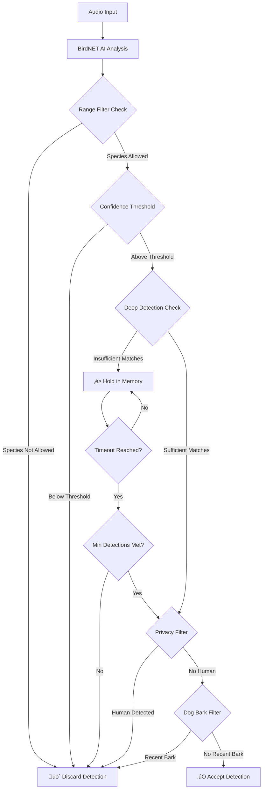
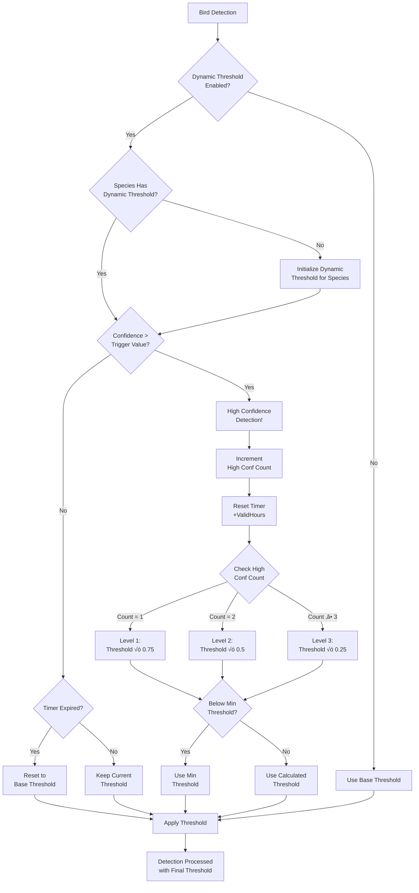
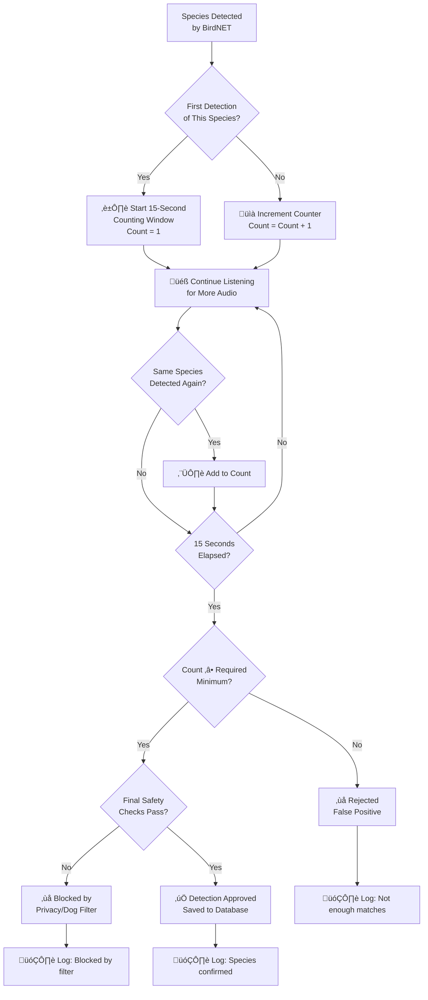

# BirdNET-Go

BirdNET-Go is an application inspired by BirdNET-Pi and BirdNET Analyzer. It aims to be a high-performance and easy-to-deploy alternative to both of these.

## BirdNET-Go Features

* Audio analysis based on the BirdNET 2.4 tflite model
* 24/7 real-time analysis of soundcard capture
* Real-time analysis output compatible with OBS chat log input for wildlife streams
* BirdWeather API support for real-time analysis
* File analysis of WAV files
* Analysis output options: Raven table, CSV file, SQLite, or MySQL database
* Localized species labels, with extensive language support (over 30 languages)
* Runs on Windows, Linux (including Raspberry Pi), and macOS
* Minimal runtime dependencies; the BirdNET TensorFlow Lite model and other supporting files are embedded in the executable
* Web dashboard with visualization capabilities
* Weather integration through OpenWeather or Yr.no
* MQTT support for IoT integration
* Advanced audio processing with equalizer filters
* Privacy and dog bark filtering capabilities
* Dynamic threshold adjustment for better detection
* OAuth2 authentication options for security
* Optional privacy-first error tracking and telemetry with Prometheus-compatible endpoint
* Sound level monitoring in 1/3rd octave bands with MQTT/SSE/Prometheus integration and configurable debug logging

## Supported Platforms

BirdNET-Go has been successfully tested on:

* Raspberry Pi 3B+ with 512MB RAM
* Raspberry Pi 4B with 4GB RAM
* Raspberry Pi 5 with 4GB RAM
* Intel NUC running Windows 10
* Intel desktop PC running Windows 11
* Intel MacBook Pro

For 24/7 real-time detection, the Raspberry Pi 3B+ is more than sufficient. It can process 3-second segments in approximately 500ms.

See the [Recommended Hardware](hardware.md) document for detailed recommendations on hardware for optimal performance, especially regarding the web interface and advanced features.

Note: TPU accelerators such as Coral.AI are not supported due to incompatibility with the BirdNET tflite model.

## Installation

### Docker Installation (Recommended for Linux)

The easiest way to install BirdNET-Go on Debian, Ubuntu, or Raspberry Pi OS is using the provided installation script which sets up BirdNET-Go as a Docker container:

```bash
curl -fsSL https://github.com/tphakala/birdnet-go/raw/main/install.sh -o install.sh
bash ./install.sh
```

**Container Registry Options:**
- **GitHub Container Registry (Primary)**: `ghcr.io/tphakala/birdnet-go`
- **Docker Hub (Mirror)**: `tphakala/birdnet-go`

Both registries contain identical images. The installation script uses GitHub Container Registry by default.

The script will:
- Check system prerequisites and install required packages
- Pull the latest BirdNET-Go Docker image from the primary registry
- Guide you through configuration (audio input, location, language, etc.)
- Create a systemd service for automatic start on boot
- Set up directories for configuration and data persistence
- Optionally configure privacy-first error tracking to help improve BirdNET-Go

The installation script includes several features:
- Support for both direct audio capture and RTSP stream sources
- Multiple audio export formats (WAV, FLAC, AAC, MP3, Opus)
- Automatic performance optimization based on detected hardware
- Configuration of web interface security
- Support for over 40 languages for species labels

### Docker Compose Installation

For users who prefer Docker Compose for container management, BirdNET-Go can also be set up using this approach. Docker Compose offers more flexibility and makes it easier to manage container configurations.

A [premade docker-compose.yml](https://github.com/tphakala/birdnet-go/blob/main/Docker/docker-compose.yml) file is available in the repository. This file includes:

- The BirdNET-Go container configuration with the latest nightly image
- Environment variables for customization (timezone, user permissions, etc.)
- Volume mounts for persistent configuration and data storage
- RAM disk (tmpfs) for HLS streaming segments to improve performance
- Device mounts for sound card access
- An optional Cloudflared service (commented out) for secure internet access

See the [Docker Compose Guide](docker_compose_guide.md) for detailed instructions on setting up BirdNET-Go with Docker Compose, including internet access configuration using Cloudflare Tunnel and security options.

### Manual Installation

Pre-compiled BirdNET-Go executables are also available at https://github.com/tphakala/birdnet-go/releases/. To install manually, download and unzip birdnet-go in any directory you wish to run it in, on Windows for example c:\users\username\birdnet-go.

#### External Dependencies

BirdNET-Go has minimal external dependencies, but requires a few specific tools for certain features:

* **TensorFlow Lite C library**: Required for the core audio analysis functionality
* **FFmpeg**: Required for RTSP stream capture, audio export to formats other than WAV (MP3, AAC, FLAC, Opus), and for the HLS live stream feature in the web interface
* **SoX**: Required for rendering spectrograms in the web interface

> **Note**: When using the Docker installation method, all these dependencies are already included in the Docker image, so you don't need to install them separately. This is one of the major advantages of using the Docker-based installation.

For manual installations, you'll need to install these dependencies separately on your system.

#### TensorFlow Lite C library

In addition to BirdNET-Go executable you also need TensorFlow Lite C library which is available for download at https://github.com/tphakala/tflite_c/releases. Download library for your target platform and install it in proper library path for your system:

* On Linux copy **libtensorflowlite_c.so** to **/usr/local/lib** and run "**sudo ldconfig**"
* On macOS **libtensorflowlite_c.dylib** to **/usr/local/lib**
* On Windows copy **libtensorflowlite_c.so** to BirdNET-Go executable directory or any other directory in system PATH

> **Note**: For optimal performance using the XNNPACK delegate (enabled by default via `usexnnpack: true` in config), ensure you have downloaded version `v2.17.1` or newer of the TensorFlow Lite C library. If a compatible library is not found, BirdNET-Go will fall back to standard CPU processing.

## Configuration

BirdNET-Go accepts several settings from command line but main configuration method is through configuration file which is created when birdnet-go is first run.

### Configuration File Locations

Configuration file location is operating system dependent and there are alternative locations for user preference.

On Linux and macOS:
- Default and primary location: **$HOME/.config/birdnet-go/config.yaml**
- Alternative location (system-wide): **/etc/birdnet-go/config.yaml**

On Windows:
- Default and primary location: **config.yaml** in the birdnet-go.exe installation directory
- Secondary location: **C:\User\username\AppData\Local\birdnet-go\config.yaml**

### Configuration File Format

The configuration file uses the YAML format, which does not recognize tabs as indentation. Below is a comprehensive breakdown of the available configuration options based on the code analysis:

```yaml
# BirdNET-Go configuration
# Paths support environment variables such as $HOME and %appdata%

debug: false  # Enable debug messages for troubleshooting

# Main application settings
main:
  name: BirdNET-Go  # Name of this node, used to identify the source of notes
  timeas24h: true   # true for 24-hour time format, false for 12-hour time format
  log:
    enabled: false  # Enable main application logging
    path: logs/birdnet.log  # Path to log file
    rotation: daily  # Log rotation type: daily, weekly, or size
    maxsize: 10485760  # Maximum log size in bytes for size rotation (10MB)
    rotationday: Sunday  # Day of the week for weekly rotation

# BirdNET model specific settings
birdnet:
  debug: false  # Enable debug mode for BirdNET functionality
  sensitivity: 1.0  # Sigmoid sensitivity, 0.1 to 1.5
  threshold: 0.8  # Threshold for prediction confidence to report, 0.0 to 1.0
  overlap: 0.0  # Overlap between chunks, 0.0 to 2.9
  latitude: 60.1699  # Latitude of recording location for prediction filtering
  longitude: 24.9384  # Longitude of recording location for prediction filtering
  threads: 0  # Number of CPU threads to use (0 = use all available, automatically optimized for P-cores if detected)
  locale: en-uk  # Language to use for labels
  modelpath: ""  # Path to external model file (empty for embedded)
  labelpath: ""  # Path to external label file (empty for embedded)
  usexnnpack: true  # Use XNNPACK delegate for inference acceleration
  rangefilter:
    debug: false  # Enable debug mode for range filter
    model: ""  # Range filter model to use. "" (default) uses V2, "legacy" uses V1.
    threshold: 0.01  # Range filter species occurrence threshold (0.0-1.0)
                     # Default (0.01) is recommended for most users
                     # Conservative values (0.05-0.1): Fewer species, higher occurrence probability
                     # Strict values (0.1-0.3): Only species with strong occurrence probability
                     # Very strict values (0.5+): Only the most common species for your area

# Realtime processing settings
realtime:
  interval: 15  # Minimum interval between repeating detections in seconds
  processingtime: false  # Report processing time for each prediction
  
  # Audio settings
  audio:
    source: ""  # Audio source to use for analysis
    ffmpegpath: ""  # Path to ffmpeg (runtime value)
    soxpath: ""  # Path to sox (runtime value)
    streamtransport: auto  # Preferred transport for audio streaming: auto, sse, or ws
    soundlevel:
      enabled: false  # Enable sound level monitoring in 1/3rd octave bands
      interval: 10  # Measurement interval in seconds (default: 10)
    export:
      debug: false  # Enable audio export debug
      enabled: false  # Export audio clips containing identified bird calls
      path: clips/  # Path to audio clip export directory
      type: wav  # Audio file type: wav, mp3, or flac
      bitrate: 192k  # Bitrate for audio export
      retention:
        debug: false  # Enable retention debug
        policy: none  # Retention policy: none, age, or usage
        maxage: 30d  # Maximum age of audio clips to keep
        maxusage: 85%  # Maximum disk usage percentage before cleanup
        minclips: 5  # Minimum number of clips per species to keep
    equalizer:
      enabled: false  # Enable equalizer filters
      filters:
        - type: LowPass  # Filter type: LowPass, HighPass, BandPass, etc.
          frequency: 10000  # Filter frequency in Hz
          q: 0.7  # Filter Q factor
          gain: 0  # Filter gain (only for certain types)
          width: 0  # Filter width (only for BandPass and BandReject)
          passes: 1  # Filter passes for added attenuation or gain
  
  # Web dashboard settings
  dashboard:
    thumbnails:
      debug: false  # Enable debug mode for thumbnails
      summary: true  # Show thumbnails on summary table
      recent: true  # Show thumbnails on recent table
    summarylimit: 20  # Limit for the number of species shown in the summary table
  
  # Dynamic threshold adjustment
  dynamicthreshold:
    enabled: false  # Enable dynamic threshold adjustment
    debug: false  # Enable debug mode for dynamic threshold
    trigger: 0.5  # Trigger threshold for dynamic adjustment
    min: 0.3  # Minimum threshold for dynamic adjustment
    validhours: 24  # Number of hours to consider for dynamic threshold
  
  # OBS chat log settings
  log:
    enabled: false  # Enable OBS chat log
    path: birdnet.txt  # Path to OBS chat log
  
  # BirdWeather API integration
  birdweather:
    enabled: false  # Enable BirdWeather uploads
    debug: false  # Enable debug mode for BirdWeather API
    id: "00000"  # BirdWeather ID / Token
    threshold: 0.9  # Threshold of prediction confidence for uploads
    locationaccuracy: 10  # Accuracy of location in meters
    retrysettings:
      enabled: true  # Enable retry mechanism
      maxretries: 5  # Maximum number of retry attempts
      initialdelay: 5  # Initial delay before first retry in seconds
      maxdelay: 300  # Maximum delay between retries in seconds
      backoffmultiplier: 2.0  # Multiplier for exponential backoff
  
  # Weather integration settings
  weather:
    provider: "yrno"  # Weather provider: none, yrno, or openweather
    pollinterval: 30  # Weather data polling interval in minutes
    debug: false  # Enable debug mode for weather integration
    openweather:
      enabled: false  # Enable OpenWeather integration (legacy setting, use 'provider' above)
      apikey: ""  # OpenWeather API key
      endpoint: "https://api.openweathermap.org/data/2.5/weather"  # OpenWeather API endpoint
      units: "metric"  # Units of measurement: standard, metric, or imperial
      language: "en"  # Language code for the response
  
  # Privacy and filtering settings
  privacyfilter:
    debug: false  # Enable debug mode for privacy filter
    enabled: false  # Enable privacy filter
    confidence: 0.8  # Confidence threshold for human detection
  
  dogbarkfilter:
    debug: false  # Enable debug mode for dog bark filter
    enabled: false  # Enable dog bark filter to prevent misdetections during dog barking
    confidence: 0.8  # Confidence threshold for dog bark detection
    remember: 60  # How long to remember barks for filtering (in seconds)
    species: ["Eurasian Eagle-Owl", "Hooded Crow"]  # Species prone to dog bark confusion
  
  # RTSP streaming settings
  rtsp:
    transport: "tcp"  # RTSP Transport Protocol: tcp or udp
    urls: []  # RTSP stream URLs
  
  # MQTT integration
  mqtt:
    enabled: false  # Enable MQTT
    broker: "localhost:1883"  # MQTT broker URL (e.g., mqtt://host:port or mqtts://host:port)
    topic: "birdnet/detections"  # MQTT topic
    username: ""  # MQTT username
    password: ""  # MQTT password
    retain: false  # Retain messages (useful for Home Assistant)
    retrysettings:
      enabled: true  # Enable retry mechanism
      maxretries: 5  # Maximum number of retry attempts
      initialdelay: 5  # Initial delay before first retry in seconds
      maxdelay: 300  # Maximum delay between retries in seconds
      backoffmultiplier: 2.0  # Multiplier for exponential backoff
  
  # Telemetry settings
  telemetry:
    enabled: false  # Enable Prometheus compatible telemetry endpoint
    listen: "localhost:9090"  # IP address and port to listen on (e.g., 0.0.0.0:9090)
  
  # Species-specific settings
  species:
    include: []  # Always include these species, bypassing range/occurrence filters
    exclude: []  # Always exclude these species, regardless of confidence
    config:  # Per-species configuration overrides
      "European Robin": # Use the exact species name from BirdNET labels
        threshold: 0.75  # Custom confidence threshold for this species
        actions:  # List of actions to execute on detection (currently only one action per species supported)
          - type: ExecuteCommand # Action type (only ExecuteCommand supported currently)
            command: "/path/to/notify_script.sh" # Full path to the script/command
            parameters: ["CommonName", "Confidence"] # Parameters to pass to the command
            executedefaults: true  # true: run default actions (DB, MQTT, etc.) AND this command. false: run ONLY this command.

# Web server settings
webserver:
  debug: false  # Enable debug mode for web server
  enabled: true  # Enable web server
  port: "8080"  # Port for web server
  log:
    enabled: false  # Enable web server logging
    path: logs/webserver.log  # Path to log file
    rotation: daily  # Log rotation type: daily, weekly, or size
    maxsize: 10485760  # Maximum log size in bytes for size rotation (10MB)
    rotationday: Sunday  # Day of the week for weekly rotation

# Security settings
security:
  debug: false  # Enable debug mode for security features
  host: ""  # Primary hostname used for TLS certificates and OAuth redirect URLs
  autotls: false  # Enable automatic TLS certificate management using Let's Encrypt
  redirecttohttps: true  # Redirect HTTP to HTTPS
  allowsubnetbypass:
    enabled: false  # Enable subnet bypass for authentication
    subnet: "192.168.1.0/24"  # Subnet to bypass authentication
  basicauth:
    enabled: false  # Enable password authentication
    password: ""  # Password for admin interface
    clientid: ""  # Client ID for OAuth2
    clientsecret: ""  # Client secret for OAuth2
    redirecturi: ""  # Redirect URI for OAuth2
    authcodeexp: 10m  # Duration for authorization code
    accesstokenexp: 1h  # Duration for access token
  googleauth:
    enabled: false  # Enable Google OAuth2
    clientid: ""  # Google client ID
    clientsecret: ""  # Google client secret
    redirecturi: ""  # Google redirect URI
    userid: ""  # Valid Google user ID
  githubauth:
    enabled: false  # Enable GitHub OAuth2
    clientid: ""  # GitHub client ID
    clientsecret: ""  # GitHub client secret
    redirecturi: ""  # GitHub redirect URI
    userid: ""  # Valid GitHub user ID
  sessionsecret: ""  # Secret for session cookie

# Output settings
# Error tracking and telemetry (optional)
sentry:
  enabled: false  # true to enable privacy-first error tracking (opt-in)

output:
  # SQLite database output settings
  sqlite:
    enabled: false  # Enable SQLite output
    path: birdnet.db  # Path to SQLite database
  
  # MySQL database output settings
  mysql:
    enabled: false  # Enable MySQL output
    username: birdnet  # MySQL database username
    password: secret  # MySQL database user password
    database: birdnet  # MySQL database name
    host: localhost  # MySQL database host
    port: 3306  # MySQL database port
```

### Command Line Interface

While the primary configuration is done via `config.yaml`, BirdNET-Go also offers several command-line operations:

```bash
birdnet [command] [flags]
```

**Available Commands:**

*   `realtime`: (Default) Starts the real-time analysis using the configuration file.
*   `file`: Analyzes a single audio file. Requires `-i <filepath>`.
*   `directory`: Analyzes all audio files in a directory. Requires `-i <dirpath>`. Can optionally use `--recursive` and `--watch`.
*   `benchmark`: Runs a performance benchmark on the current system.
*   `range`: Manages the range filter database (used for location-based species filtering).
    *   `range update`: Downloads or updates the range filter database.
    *   `range info`: Displays information about the current range filter database.
    *   `range print`: Shows all species that pass the current threshold for your location and date, with their probability scores.
*   `support`: Generates a support bundle containing logs and configuration (with sensitive data masked) for troubleshooting.
*   `authors`: Displays author information.
*   `license`: Displays software license information.
*   `help`: Shows help for any command.

**Global Flags (can be used with most commands):**

Many configuration options can be overridden via command-line flags (e.g., `--threshold 0.7`, `--locale fr`). Run `birdnet [command] --help` to see all available flags for a specific command. Some common global flags include:

*   `-d, --debug`: Enable debug output.
*   `-s, --sensitivity`: Set sigmoid sensitivity (0.0 to 1.5).
*   `-t, --threshold`: Set confidence threshold (0.1 to 1.0).
*   `-j, --threads`: Set number of CPU threads (0 for auto).
*   `--locale`: Set language for labels (e.g., `en-us`, `de`).
*   `--latitude`, `--longitude`: Set location coordinates.
*   `--overlap`: Set analysis overlap (0.0 to 2.9).

### Supported Languages for Species Labels

BirdNET-Go supports an extensive list of languages for species labels. This is significantly expanded from what was shown in the original wiki page:

- Afrikaans (af)
- Arabic (ar)
- Bulgarian (bg)
- Catalan (ca)
- Chinese (zh)
- Croatian (hr)
- Czech (cs)
- Danish (da)
- Dutch (nl)
- English (UK) (en-uk)
- English (US) (en-us)
- Estonian (et)
- Finnish (fi)
- French (fr)
- German (de)
- Greek (el)
- Hebrew (he)
- Hungarian (hu)
- Icelandic (is)
- Indonesian (id)
- Italian (it)
- Japanese (ja)
- Korean (ko)
- Latvian (lv)
- Lithuanian (lt)
- Malayalam (ml)
- Norwegian (no)
- Polish (pl)
- Portuguese (pt)
- Portuguese (Brazil) (pt-br)
- Portuguese (Portugal) (pt-pt)
- Romanian (ro)
- Russian (ru)
- Serbian (sr)
- Slovak (sk)
- Slovenian (sl)
- Spanish (es)
- Swedish (sv)
- Thai (th)
- Turkish (tr)
- Ukrainian (uk)

## Troubleshooting

### Docker Installation Troubleshooting

If you're having issues with your Docker-based BirdNET-Go installation, here are some common commands and solutions:

#### Service Management

```bash
# Check service status
sudo systemctl status birdnet-go

# Start the service
sudo systemctl start birdnet-go

# Stop the service
sudo systemctl stop birdnet-go

# Restart the service
sudo systemctl restart birdnet-go

# View logs (most recent entries)
sudo journalctl -u birdnet-go -n 50

# Follow logs in real-time
sudo journalctl -fu birdnet-go
```

#### Common Issues and Solutions

1. **No sound detected**:
   - Check that your user is in the audio group: `groups $USER`
   - Verify audio device is connected and recognized: `arecord -l`
   - Ensure the Docker container has access to audio devices by checking the service file

2. **Web interface not accessible**:
   - Verify the service is running: `sudo systemctl status birdnet-go`
   - Check that port 8080 (or your configured port) is not blocked by a firewall
   - Confirm the port binding in the Docker container: `docker ps | grep birdnet-go`

3. **Container exits immediately after starting**:
   - Check logs for errors: `sudo journalctl -u birdnet-go -n 100`
   - Verify correct volume mappings in the service file
   - Check permissions on the config and data directories

4. **Low detection rate or poor performance**:
   - Verify your latitude/longitude settings are correct in config.yaml
   - Check if audio device is working properly: `arecord -d 5 -f S16_LE -r 48000 test.wav`
   - Adjust sensitivity and threshold settings in the configuration file

5. **Constant 'WARNING: BirdNET processing time exceeded buffer length' messages:**
   - If you have enabled Deep Detection (by setting a high `birdnet.overlap` value, e.g., 2.7), your system might not be powerful enough to keep up with the increased analysis rate. Consider reducing the `birdnet.overlap` value or using more powerful hardware (RPi 4/5 or better recommended for Deep Detection).

#### Updating a Docker Installation (`install.sh` method)

If you installed BirdNET-Go using the recommended `install.sh` script, you can update to the latest version by simply re-running the script:

1.  It is **recommended to download a fresh copy** of the script each time, as it may contain improvements:
    ```bash
    curl -fsSL https://github.com/tphakala/birdnet-go/raw/main/install.sh -o install.sh
    ```
2.  Run the downloaded script:
    ```bash
    bash ./install.sh
    ```
3.  The script will detect your installation and offer an "Update" option. Selecting it will stop the service, pull the newest `nightly` image, update the service configuration if needed, and restart BirdNET-Go. Your configuration and data will be preserved.

### Support Script

For more comprehensive troubleshooting, BirdNET-Go provides a support script that collects diagnostic information while protecting your privacy:

```bash
curl -fsSL https://github.com/tphakala/birdnet-go/raw/main/support.sh -o support.sh
sudo bash ./support.sh
```

The script will:
- Collect system information (hardware, OS, etc.)
- Gather Docker configuration and logs
- Retrieve BirdNET-Go configuration (with sensitive data masked)
- Capture systemd service information
- Collect audio device information
- Create a support bundle for sharing with developers

### Reporting Issues

If you encounter problems that you can't resolve, please open an issue on the GitHub repository:

1. Go to https://github.com/tphakala/birdnet-go/issues
2. Click "New Issue"
3. Fill out the issue template carefully, including:
   - What you expected to happen
   - What actually happened
   - Complete steps to reproduce the issue
   - Relevant logs and configuration details
   - Attach the support bundle generated by the support script if available

Providing detailed information in your issue report will help the developers understand and resolve your problem more quickly.

## BirdNET Detection Pipeline

Understanding how BirdNET-Go processes audio and applies various filters is crucial for optimizing your detection accuracy. The detection process follows a multi-stage pipeline where settings are applied in a specific order of precedence.

### Detection Flow Overview

The detection process follows a multi-stage pipeline where settings are applied in a specific order of precedence:



### Stage 1: Range Filter (Highest Precedence)

The **Range Filter** acts as the primary gatekeeper, determining which species are even possible to detect based on location and time. This stage has the highest precedence and cannot be overridden by confidence settings.

#### Components (in order of precedence):

1. **Always Exclude Species** (Absolute Override)
   - Species in this list are **never** detected, regardless of any other settings
   - Useful for filtering out non-bird sounds (Dog, Siren, Gun) or problematic species
   - Configured via: Settings → Species → "Always Exclude Species"

2. **Always Include Species** (Absolute Override)
   - Species in this list are **always** allowed, bypassing location-based filtering
   - Automatically assigned maximum probability score (1.0)
   - Configured via: Settings → Species → "Always Include Species"

3. **Custom Action Species** (Automatic Include)
   - Species with configured custom actions are automatically included
   - Also assigned maximum probability score (1.0)

4. **Location-Based Filtering** 
   - Uses AI model trained on eBird data to determine species probability
   - Considers latitude, longitude, and week of year
   - Filtered by `birdnet.rangefilter.threshold` (default: 0.01)

```yaml
# Range filter configuration
birdnet:
  latitude: 60.1699
  longitude: 24.9384
  rangefilter:
    threshold: 0.01  # Lower = more permissive, higher = more strict
```

### Stage 2: Confidence Threshold

After the range filter allows a species, individual detections must meet confidence requirements.

#### Confidence Sources (in order of precedence):

1. **Custom Species Threshold** (Highest)
   ```yaml
   realtime:
     species:
       config:
         "European Robin":
           threshold: 0.75  # Overrides global threshold
   ```

2. **Dynamic Threshold** (If enabled)
   - Automatically adjusts thresholds based on detection patterns
   - Can lower thresholds for frequently detected species
   
3. **Global BirdNET Threshold** (Default)
   ```yaml
   birdnet:
     threshold: 0.8  # Default confidence requirement
   ```

### Dynamic Threshold System

The Dynamic Threshold feature intelligently adapts detection sensitivity for individual species based on recent high-confidence detections. This system helps improve detection rates for species that are actively present in your area while maintaining accuracy.

#### How Dynamic Thresholds Work



#### Configuration

```yaml
realtime:
  dynamicthreshold:
    enabled: true       # Enable dynamic threshold adjustment (default: true)
    debug: false        # Enable debug logging for threshold changes
    trigger: 0.90       # Confidence level that triggers threshold reduction
    min: 0.20          # Minimum allowed threshold (safety floor)
    validhours: 24     # Hours before threshold resets to base value
```

#### Key Parameters Explained

1. **`trigger`** (default: 0.90)
   - The confidence level that activates dynamic threshold adjustment
   - When a detection exceeds this value, the system starts lowering the threshold for that species
   - Example: With trigger=0.90, only very high-confidence detections (90%+) will activate the dynamic adjustment

2. **`min`** (default: 0.20)
   - The absolute minimum threshold value
   - Prevents the threshold from dropping too low, maintaining detection quality
   - Acts as a safety floor to prevent excessive false positives

3. **`validhours`** (default: 24)
   - Duration (in hours) that the lowered threshold remains active
   - Timer resets with each new high-confidence detection
   - After this period without high-confidence detections, the threshold returns to base value

#### Threshold Adjustment Levels

The system uses a progressive adjustment based on the number of high-confidence detections:

| High Conf Count | Level | Threshold Multiplier | Example (Base: 0.8) |
|-----------------|-------|---------------------|-------------------|
| 0               | 0     | 1.0× (base)         | 0.80             |
| 1               | 1     | 0.75×               | 0.60             |
| 2               | 2     | 0.50×               | 0.40             |
| 3+              | 3     | 0.25×               | 0.20 (min limit) |

#### Practical Example

Let's walk through a scenario with these settings:
```yaml
birdnet:
  threshold: 0.8        # Base threshold
realtime:
  dynamicthreshold:
    enabled: true
    trigger: 0.9        # High trigger for quality
    min: 0.2           # Safety floor
    validhours: 24     # 24-hour window
```

**Scenario: Great Horned Owl Detection**

1. **Initial State**: Great Horned Owl has no dynamic threshold, uses base 0.8
2. **First Detection**: 
   - 19:30 (dusk) - Great Horned Owl detected with 0.93 confidence (exceeds 0.9 trigger)
   - High confidence count: 1
   - New threshold: 0.8 × 0.75 = 0.6
   - Timer set to expire at 19:30 tomorrow
3. **Night Activity**:
   - 21:45 - Great Horned Owl detected with 0.65 confidence (now passes lowered threshold)
   - 23:15 - Another detection with 0.94 confidence
   - High confidence count: 2
   - New threshold: 0.8 × 0.5 = 0.4
   - Timer reset to 23:15 tomorrow
4. **Pre-dawn Activity**:
   - 04:30 - Detection with 0.91 confidence
   - High confidence count: 3
   - Calculated threshold: 0.8 × 0.25 = 0.2
   - Applied threshold: 0.2 (exactly at min limit)
5. **Daytime Silence**:
   - Owls typically inactive during day
   - No detections from 05:00 to 19:00
6. **Reset Scenario**:
   - If no high-confidence detections occur for 24 hours after 04:30
   - Threshold returns to base 0.8
   - Next evening's first call would need 0.8+ confidence again

#### Benefits and Use Cases

1. **Adaptive Sensitivity**: Automatically becomes more sensitive to species that are actively vocalizing in your area
2. **Quality Maintenance**: High trigger values ensure only quality detections influence the system
3. **Temporal Awareness**: Accounts for daily activity patterns with the time-based reset
4. **Species-Specific**: Each species maintains its own dynamic threshold independently
5. **Safety Limits**: Minimum threshold prevents excessive false positives

#### Best Practices

1. **Conservative Trigger**: Set trigger high (0.8-0.95) to ensure only clear detections adjust thresholds
2. **Reasonable Minimum**: Keep min at or above 0.2 to maintain detection quality
3. **Monitor with Debug**: Enable debug mode initially to understand how thresholds change:
   ```yaml
   dynamicthreshold:
     debug: true  # Logs threshold changes
   ```
4. **Combine with Deep Detection**: For best results, use with deep detection to filter false positives:
   ```yaml
   birdnet:
     overlap: 2.7      # Deep detection
   realtime:
     dynamicthreshold:
       enabled: true   # Adaptive thresholds
   ```

#### Important Notes

- Dynamic thresholds work **after** the range filter - species must pass location filtering first
- Each species threshold is independent - one species' activity doesn't affect others
- The system automatically cleans up stale thresholds to prevent memory bloat
- Custom species thresholds (if configured) take precedence over dynamic adjustments

### Stage 3: Deep Detection Filter

[Deep Detection](BirdNET‐Go-Guide#deep-detection) uses the `overlap` setting to require multiple detections of the same species within a 15-second window before accepting it, significantly reducing false positives.

#### How It Works:

1. **Detection Holding**: All detections are held in a pending state for **exactly 15 seconds** from first detection
2. **Counting Mechanism**: During this window, if the same species is detected again, a counter increments
3. **Threshold Calculation**: The minimum required detections scales inversely with overlap:

```yaml
birdnet:
  overlap: 2.7  # Enable deep detection (requires more CPU power)
```

**Exact Minimum Detections Calculation:**
```
segmentLength = max(0.1, 3.0 - overlap)
minDetections = max(1, 3 / segmentLength)

Examples:
- overlap: 0.0  → segmentLength: 3.0  → minDetections: 1  (standard mode)
- overlap: 1.5  → segmentLength: 1.5  → minDetections: 2
- overlap: 2.7  → segmentLength: 0.3  → minDetections: 10 (deep detection)  
- overlap: 2.9  → segmentLength: 0.1  → minDetections: 30 (very strict)
```

#### Processing Timeline:

1. **0 seconds**: Species detected for first time, 15-second timer starts
2. **0-15 seconds**: Additional detections increment the counter
3. **15 seconds**: Decision point reached:
   - **If count ≥ minDetections**: Detection approved and processed
   - **If count < minDetections**: Detection discarded as "false positive"

#### Key Behavior Notes:

- **Hard 15-second timeout**: Detections are **always** decided after exactly 15 seconds
- **No early approval**: Even if minimum detections are met before 15 seconds, the system waits for the full window
- **Quality improvement**: Higher confidence detections within the window replace lower ones
- **Memory efficient**: Only one pending detection per species is held at a time

### Stage 4: Privacy and Behavioral Filters

Final stage filters that can discard detections based on environmental conditions:

#### Privacy Filter
```yaml
realtime:
  privacyfilter:
    enabled: true
    confidence: 0.05  # Sensitivity to human voices
```
- Discards bird detections if human speech is detected after the initial detection
- Protects privacy by preventing recordings during conversations

#### Dog Bark Filter  
```yaml
realtime:
  dogbarkfilter:
    enabled: true
    confidence: 0.8
    remember: 60  # Seconds to remember bark
    species: ["Eurasian Eagle-Owl", "Hooded Crow"]  # Species prone to confusion with barks
```
- **Problem Solved**: The BirdNET AI model frequently confuses dog barks with certain bird calls, especially owl vocalizations (very common: dog bark → Eurasian Eagle-Owl)
- **How It Works**: When BirdNET detects dog barking above the confidence threshold, it temporarily disables detection of species listed in the filter for the specified duration
- **Use Cases**: Prevents false detections during periods of constant dog barking, particularly for species that have acoustic similarities to canine vocalizations
- **Species Selection**: Focus on owl species (especially larger owls) and corvids (crows/ravens) which are most commonly confused with dog barks

### Setting Precedence Summary

**Highest to Lowest Precedence:**

1. **Always Exclude Species** - Absolute veto power
2. **Always Include Species** - Bypasses all location filtering  
3. **Custom Action Species** - Automatically included
4. **Range Filter Threshold** - Location-based species filtering
5. **Custom Species Confidence** - Overrides global threshold
6. **Dynamic Threshold** - Automatic adjustment (if enabled)
7. **Global Confidence Threshold** - Default requirement
8. **Deep Detection Filter** - Requires multiple matches
9. **Privacy Filter** - Environmental safety
10. **Dog Bark Filter** - Behavioral filtering

### Optimization Tips

#### For Higher Accuracy (Fewer False Positives):
- Increase `birdnet.threshold` (e.g., 0.9)
- Enable deep detection with `overlap: 2.7`
- Use stricter range filter threshold (e.g., 0.05)
- Enable privacy and dog bark filters (especially for owl/crow confusion)

#### For Higher Sensitivity (Catch More Species):
- Lower `birdnet.threshold` (e.g., 0.6)
- Use permissive range filter threshold (0.01)
- Add rare species to "Always Include" list
- Disable behavioral filters in quiet environments

#### For Specific Species:
- Use custom thresholds for problematic species
- Add reliable local species to "Always Include"
- Add problematic non-bird sounds to "Always Exclude"

### Viewing Your Current Configuration

Use these commands to inspect your current detection settings:

```bash
# View species included by range filter
./birdnet-go range print

# View all CLI options
./birdnet-go help

# View range filter specific options  
./birdnet-go help range
```

## BirdNET Range Filter

The BirdNET Range Filter is an intelligent location and time-based filtering system that helps improve detection accuracy by limiting species predictions to those likely to occur in your specific location during the current time of year.

### How It Works

#### Model Overview

The range filter uses a secondary AI model trained on [eBird checklist frequency data](https://support.ebird.org/en/support/solutions/articles/48000948655-ebird-glossary#:~:text=frequency%3A%20as%20of%20a%20species,purple%20grid%20on%20species%20maps) to estimate the probability of bird species occurrence based on three factors:

1. **Latitude** - Your geographic latitude coordinate
2. **Longitude** - Your geographic longitude coordinate  
3. **Week of Year** - The current week (1-52) to account for seasonal migration patterns

The model analyzes these inputs and assigns each species a probability score from 0.0 to 1.0, representing how likely that species is to occur in your location during that time period.

#### eBird Data Coverage

The range filter model is built using citizen science data from [eBird](https://ebird.org), which means coverage varies by region:

- **Well-represented regions**: North America, South America, Europe, India, Australia
- **Underrepresented regions**: Large parts of Africa and Asia

In areas with limited eBird data, the model uses expert-curated filter data to provide basic species occurrence information.

### Configuration

#### Basic Setup

The range filter is configured in the `birdnet.rangefilter` section of your configuration file:

```yaml
birdnet:
  latitude: 60.1699   # Your location latitude
  longitude: 24.9384  # Your location longitude
  rangefilter:
    debug: false      # Enable debug logging
    model: ""         # "" for V2 (default), "legacy" for V1  
    threshold: 0.01   # Species occurrence threshold (0.0-1.0)
```

> **Note**: The configuration uses `birdnet.rangefilter` in YAML, while CLI commands use the `range` group (e.g., `birdnet-go range print`). These refer to the same functionality.

#### Understanding the Threshold Parameter

The `threshold` parameter controls which species are included in analysis based on their occurrence probability. **The default value of 0.01 is recommended for most users and rarely needs to be changed** unless you have very specific requirements.

- **Default (0.01)**: Permissive filtering that works well for most locations and use cases
- **Conservative values (0.05-0.1)**: Include fewer species, only those with higher occurrence probability
- **Strict values (0.1-0.3)**: Include only species with strong occurrence probability
- **Very strict values (0.5+)**: Include only the most common species for your area

**Tip**: If the range filter results don't match your expectations for specific species, you can override them using the **Species Settings** in the web interface (Settings → Species) rather than adjusting the global threshold.

### Configuration Examples

#### Example 1: Default Permissive Filtering
```yaml
rangefilter:
  threshold: 0.01  # Default - good for most users
```
- Includes species with ≥1% occurrence probability
- Captures most potential species including occasional visitors
- Balanced approach suitable for most locations

#### Example 2: Conservative Filtering
```yaml
rangefilter:
  threshold: 0.05
```
- Includes species with ≥5% occurrence probability
- Reduces potential false positives from very unlikely species
- Good balance between coverage and accuracy

#### Example 3: Strict Filtering
```yaml
rangefilter:
  threshold: 0.1
```
- Includes only species with ≥10% occurrence probability
- Reduces false positives from unlikely species
- Good for areas with excellent eBird coverage
- May miss rare but possible species

#### Example 4: Very Strict Filtering
```yaml
rangefilter:
  threshold: 0.3
```
- Includes only species with ≥30% occurrence probability
- Focuses on common resident and seasonal species
- Minimizes false positives
- May miss genuine detections of less common species

### Species Override Management

#### Override Behavior

The range filter works alongside your manual species configuration:

1. **Always Include Species**: Species in this list are **always** included regardless of range filter scores
2. **Always Exclude Species**: Species in this list are **always** excluded regardless of range filter scores  
3. **Custom Actions**: Species with configured actions are automatically included with maximum score

#### Managing Species Lists via Web Interface

You can easily manage species overrides through the web dashboard:

- Navigate to **Settings → Species** in the web interface
- **"Always Include Species"** section: Add species that should never be filtered out
- **"Always Exclude Species"** section: Add species that should never be detected
  - Useful for non-bird sounds like "Dog", "Siren", "Gun", "Fireworks"
  - Helpful for consistently problematic species in your area
- Changes are applied immediately without restarting the application

### Inspection and Debugging

#### Viewing Current Filter Results

You can inspect what species are included for your location using the CLI command (run `birdnet-go help range` for more options):

```bash
./birdnet-go range print
```

This displays all species that pass the threshold for your current location and date, showing their probability scores.

#### Range Filter Models

BirdNET-Go supports two range filter model versions:

- **V2 (Default)**: Latest model with improved accuracy
- **V1 (Legacy)**: Original model, use `model: "legacy"` if needed for compatibility

The V2 model generally provides better predictions and should be used unless you have specific compatibility requirements.

### Troubleshooting

#### Common Issues and Solutions

**Problem**: Too many false positives
- **Solution**: Increase the `threshold` value (try 0.05 or 0.1)

**Problem**: Missing obvious local species  
- **Solution**: Add the species to the "Always Include Species" list via **Settings → Species** in the web interface, or lower the `threshold` value if many species are missing

**Problem**: No location-based filtering occurring
- **Solution**: Verify `latitude` and `longitude` are set correctly (non-zero values)

**Problem**: Seasonal migrants not detected during migration
- **Solution**: Lower the `threshold` temporarily during migration periods, or add specific migrants to the "Always Include Species" list

**Problem**: Non-bird sounds being detected (dogs, sirens, etc.)
- **Solution**: Add these to the "Always Exclude Species" list via **Settings → Species**

## Advanced Features

### Web Dashboard

BirdNET-Go includes a web dashboard that provides visualization and management capabilities. The dashboard features:
- Summary views of detected species
- Recent detections display
- Optional thumbnails for visual identification
- Configurable display limits
- Images are automatically cached in the background to improve loading performance.

### Remote Internet Access

BirdNET-Go can be securely exposed to the internet, allowing you to monitor your birds from anywhere. The **recommended method** is using Cloudflare Tunnel (cloudflared), which provides:

- **Enhanced Security**: No need to open ports on your router/firewall
- **End-to-End Encryption**: All traffic is securely encrypted
- **Performance Benefits**: Static content like spectrograms and audio clips are cached on Cloudflare's global network
- **Simple Setup**: Works with any BirdNET-Go installation method (Docker, Docker Compose, or binary)

For detailed setup instructions and security best practices, see the dedicated [Cloudflare Tunnel Guide](cloudflare_tunnel_guide.md).

> **IMPORTANT SECURITY WARNING**: When exposing BirdNET-Go to the internet, always enable authentication through one of the available methods (Basic Auth, Google OAuth, or GitHub OAuth). Without authentication, anyone with your URL can access your system, delete your data, change settings, and view your location. See the [Authentication section](cloudflare_tunnel_guide.md#enabling-authentication) of the guide for details.

### Weather Integration

The application supports weather data integration from two providers:
- Yr.no (default)
- OpenWeather API (requires API key)

Weather data can be used to correlate bird activity with environmental conditions and is displayed in the dashboard.

### Audio Processing

BirdNET-Go offers advanced audio processing capabilities:
- Support for various audio sources including direct soundcard capture and RTSP streams
- Configurable equalizer with multiple filter types (LowPass, HighPass, BandPass, etc.)
- Audio export in multiple formats (WAV, MP3, FLAC)
- Retention policies for managing exported audio clips

### Audio Clip Retention

If you enable audio clip exporting (`realtime.audio.export.enabled: true`), BirdNET-Go can automatically manage disk space by deleting older recordings based on configured retention policies. This prevents your disk from filling up over time.

The cleanup task runs periodically (every few minutes) to check if clips need to be deleted based on the selected policy.

Configure these options under `realtime.audio.export.retention` in your `config.yaml`:

*   **`policy`**: Sets the retention strategy. Options are:
    *   **`none`** (Default): No automatic deletion. You are responsible for managing the clip files.
    *   **`age`**: Deletes clips older than the specified `maxage`.
    *   **`usage`**: Deletes the oldest clips *only when* the disk usage of the partition containing the clips directory exceeds the `maxusage` percentage. This policy tries to keep at least `minclips` per species, deleting the oldest clips first when cleanup is needed.
*   **`maxage`**: (Used with `policy: age`) Maximum age for clips (e.g., `30d` for 30 days, `7d` for 7 days, `24h` for 24 hours). Clips older than this will be deleted.
*   **`maxusage`**: (Used with `policy: usage`) The target maximum disk usage percentage (e.g., `85%`). Cleanup triggers when usage exceeds this threshold.
*   **`minclips`**: (Used with `policy: usage`) The minimum number of clips to keep for each species, even when cleaning up based on disk usage. This ensures you retain at least some recent examples per species.

### Security Features

The application includes several security options:
- Basic authentication with password protection
- OAuth2 authentication through Google or GitHub
- Automatic TLS certificate management via Let's Encrypt
- IP subnet-based authentication bypass for local networks

### Filtering Capabilities

BirdNET-Go includes intelligent filtering mechanisms:
- Privacy filter to ignore human voices
- Dog bark filter to prevent misdetections when BirdNET confuses barking with owl/crow calls
- Species-specific inclusion and exclusion lists
- Dynamic threshold adjustment based on detection patterns

### Deep Detection

BirdNET-Go includes a "Deep Detection" feature designed to improve detection reliability and reduce false positives by requiring multiple detections of the same species within a time window.

#### Deep Detection Flow Chart



#### How Deep Detection Works

1. **Increased Analysis Frequency**: Higher `overlap` values reduce the step size between audio analysis windows (e.g., from 1.5 seconds to 300ms), causing the BirdNET AI model to run more frequently

2. **Pending Detection System**: All detections are held in memory for exactly **15 seconds** from the first detection

3. **Counting Mechanism**: During the 15-second window, each additional detection of the same species increments a counter

4. **Variable Threshold**: The number of required detections scales with the overlap setting:
   ```
   Required Detections = max(1, 3 / max(0.1, 3.0 - overlap))
   
   Examples:
   - overlap: 0.0 → 1 detection required (standard mode)
   - overlap: 2.4 → 5 detections required  
   - overlap: 2.7 → 10 detections required (typical deep detection)
   - overlap: 2.9 → 30 detections required (very strict)
   ```

5. **Decision Point**: After exactly 15 seconds, the detection is either approved (if minimum count reached) or discarded as a false positive

#### Benefits and Use Cases

*   **False Positive Reduction**: Eliminates single spurious detections that don't repeat
*   **Lower Threshold Tolerance**: Allows using lower `birdnet.threshold` values (e.g., 0.3-0.6) while maintaining accuracy
*   **Quality Selection**: Keeps the highest confidence detection from the 15-second window
*   **Consistent Behavior**: All detections are held for exactly 15 seconds, providing predictable timing

#### System Requirements

*   **CPU Load**: Significantly increases processing requirements due to higher analysis frequency
*   **Recommended Hardware**: Raspberry Pi 4/5 or more powerful systems
*   **Performance Monitoring**: Watch for `WARNING: BirdNET processing time exceeded buffer length` messages indicating the system cannot keep up

#### Configuration

*   **Docker Installation**: Deep Detection is **enabled by default** with the `install.sh` script, which benchmarks your hardware and sets appropriate overlap values
*   **Manual Configuration**: Set `birdnet.overlap` in your `config.yaml`:
    ```yaml
    birdnet:
      overlap: 2.7  # Enable deep detection (10 detections required)
      threshold: 0.5  # Can use lower thresholds with deep detection
    ```
*   **Disabling**: Set `overlap: 0.0` for standard single-detection mode

#### Reference
[[GitHub Discussion #302](https://github.com/tphakala/birdnet-go/discussions/302)]

### Live Audio Streaming

BirdNET-Go allows you to listen to the live audio feed directly from the web interface. This is useful for monitoring the audio quality, checking microphone placement, or simply listening to the ambient sounds.

*   **How to Use:**
    1.  Locate the microphone icon / audio level indicator in the web interface header.
    2.  Click the icon to open the audio source dropdown.
    3.  If you have multiple audio sources configured (e.g., a sound card and RTSP streams), select the source you wish to listen to.
    4.  Click the play icon (▶️) next to the source name.
    5.  Audio playback will begin using your browser's audio capabilities.
    6.  Click the stop icon (⏹️) to end the stream.
*   **Technology:** The live stream uses HLS (HTTP Live Streaming) for broad browser compatibility and efficient delivery.
*   **Dependency:** This feature requires **FFmpeg** to be installed and accessible by BirdNET-Go. If FFmpeg is not found, the play button may not appear or function.
*   **Server Interaction:** Starting the live stream initiates audio encoding on the server. The stream uses a heartbeat mechanism to stay active while you are listening. Stopping the stream or closing the browser tab/window signals the server to stop the encoding process, conserving server resources.

### Sound Level Monitoring

BirdNET-Go includes an advanced sound level monitoring feature that provides detailed acoustic measurements of your environment in 1/3rd octave bands. This feature is particularly useful for:

- **Environmental noise monitoring**: Track ambient noise levels over time
- **Acoustic habitat assessment**: Understand the soundscape characteristics of your monitoring location
- **IoT integration**: Send detailed sound level data to smart home systems or environmental monitoring platforms
- **Research applications**: Collect standardized acoustic measurements for scientific studies

#### How It Works

The sound level monitoring system:
1. **Analyzes audio in 1/3rd octave bands** following the ISO 266 standard (25 Hz to 20 kHz)
2. **Aggregates measurements over 10-second windows** to provide stable readings
3. **Calculates min/max/mean values** for each frequency band within the window
4. **Publishes data via multiple channels**: MQTT, SSE, and Prometheus metrics

##### Audio Processing Architecture

The sound level measurement system reads the raw audio directly from the source without any equalization or filtering applied. This ensures that measurements reflect the actual acoustic environment:

- **Raw Audio Input**: Audio samples are processed directly as received from the audio source (internal/myaudio/soundlevel.go:268-271)
- **Direct Band Analysis**: Raw samples are passed through octave band filters without any pre-processing or equalization (internal/myaudio/soundlevel.go:308-310)
- **Pure Measurement**: The octave band filters isolate specific frequency bands for measurement but do not apply any equalization - they simply measure the energy present in each frequency band (internal/myaudio/soundlevel.go:143-220)
- **Unmodified Output**: Sound level data is sanitized for JSON compatibility and published without any acoustic modifications (internal/analysis/sound_level.go)

This approach ensures that sound level measurements represent the true acoustic conditions at the monitoring location, which is essential for environmental monitoring, research applications, and compliance with acoustic measurement standards.

#### Configuration

Enable sound level monitoring in your `config.yaml`:

```yaml
realtime:
  audio:
    soundlevel:
      enabled: true              # Enable sound level monitoring (default: false)
      interval: 10               # Measurement interval in seconds (default: 10)
      debug: false               # Enable debug logging (default: false)
      debug_realtime_logging: false  # Enable per-sample debug logs (default: false)
```

> **Note**: Sound level monitoring is disabled by default to avoid performance overhead. Enable it only if you need this functionality.

#### Data Format

Sound level data is published as JSON with the following structure:

```json
{
  "timestamp": "2024-01-15T08:30:45Z",
  "source": "USB Audio Device",
  "name": "Primary Microphone",
  "duration_seconds": 10,
  "octave_bands": {
    "1.0_kHz": {
      "center_frequency_hz": 1000,
      "min_db": -45.2,
      "max_db": -38.7,
      "mean_db": -42.1
    },
    // ... additional frequency bands ...
  }
}
```

#### Integration Examples

##### MQTT Integration
When MQTT is enabled, sound level data is published to the topic:
```
<base_topic>/soundlevel
```

The MQTT message uses a compact JSON format to minimize payload size:

```json
{
  "ts": "2024-01-15T08:30:45Z",
  "src": "USB Audio Device",
  "nm": "Primary Microphone",
  "dur": 10,
  "b": {
    "25.0_Hz": {
      "f": 25.0,
      "n": -85.2,
      "x": -78.7,
      "m": -82.1
    },
    "31.5_Hz": {
      "f": 31.5,
      "n": -83.5,
      "x": -76.2,
      "m": -80.3
    },
    "40.0_Hz": {
      "f": 40.0,
      "n": -81.7,
      "x": -74.5,
      "m": -78.6
    },
    "50.0_Hz": {
      "f": 50.0,
      "n": -79.8,
      "x": -72.3,
      "m": -76.4
    },
    "63.0_Hz": {
      "f": 63.0,
      "n": -77.6,
      "x": -70.1,
      "m": -74.2
    },
    "80.0_Hz": {
      "f": 80.0,
      "n": -75.3,
      "x": -67.8,
      "m": -71.9
    },
    "100.0_Hz": {
      "f": 100.0,
      "n": -72.9,
      "x": -65.4,
      "m": -69.5
    },
    "125.0_Hz": {
      "f": 125.0,
      "n": -70.4,
      "x": -62.9,
      "m": -67.0
    },
    "160.0_Hz": {
      "f": 160.0,
      "n": -67.8,
      "x": -60.3,
      "m": -64.4
    },
    "200.0_Hz": {
      "f": 200.0,
      "n": -65.1,
      "x": -57.6,
      "m": -61.7
    },
    "250.0_Hz": {
      "f": 250.0,
      "n": -62.3,
      "x": -54.8,
      "m": -58.9
    },
    "315.0_Hz": {
      "f": 315.0,
      "n": -59.4,
      "x": -51.9,
      "m": -56.0
    },
    "400.0_Hz": {
      "f": 400.0,
      "n": -56.4,
      "x": -48.9,
      "m": -53.0
    },
    "500.0_Hz": {
      "f": 500.0,
      "n": -53.3,
      "x": -45.8,
      "m": -49.9
    },
    "630.0_Hz": {
      "f": 630.0,
      "n": -50.1,
      "x": -42.6,
      "m": -46.7
    },
    "800.0_Hz": {
      "f": 800.0,
      "n": -46.8,
      "x": -39.3,
      "m": -43.4
    },
    "1.0_kHz": {
      "f": 1000.0,
      "n": -43.3,
      "x": -35.8,
      "m": -39.9
    },
    "1.25_kHz": {
      "f": 1250.0,
      "n": -39.7,
      "x": -32.2,
      "m": -36.3
    },
    "1.6_kHz": {
      "f": 1600.0,
      "n": -36.0,
      "x": -28.5,
      "m": -32.6
    },
    "2.0_kHz": {
      "f": 2000.0,
      "n": -32.2,
      "x": -24.7,
      "m": -28.8
    },
    "2.5_kHz": {
      "f": 2500.0,
      "n": -28.3,
      "x": -20.8,
      "m": -24.9
    },
    "3.15_kHz": {
      "f": 3150.0,
      "n": -24.2,
      "x": -16.7,
      "m": -20.8
    },
    "4.0_kHz": {
      "f": 4000.0,
      "n": -20.0,
      "x": -12.5,
      "m": -16.6
    },
    "5.0_kHz": {
      "f": 5000.0,
      "n": -15.7,
      "x": -8.2,
      "m": -12.3
    },
    "6.3_kHz": {
      "f": 6300.0,
      "n": -11.2,
      "x": -3.7,
      "m": -7.8
    },
    "8.0_kHz": {
      "f": 8000.0,
      "n": -6.6,
      "x": 0.9,
      "m": -3.2
    },
    "10.0_kHz": {
      "f": 10000.0,
      "n": -1.8,
      "x": 5.7,
      "m": 1.6
    },
    "12.5_kHz": {
      "f": 12500.0,
      "n": 3.1,
      "x": 10.6,
      "m": 6.5
    },
    "16.0_kHz": {
      "f": 16000.0,
      "n": 8.1,
      "x": 15.6,
      "m": 11.5
    },
    "20.0_kHz": {
      "f": 20000.0,
      "n": 13.3,
      "x": 20.8,
      "m": 16.7
    }
  }
}
```

**Field Reference:**
- `ts`: ISO8601 timestamp
- `src`: Audio source identifier
- `nm`: Human-readable name of the source
- `dur`: Measurement duration in seconds
- `b`: Octave bands object containing measurements for each frequency band
  - Band key format: `<frequency>_<unit>` (e.g., "1.0_kHz", "250.0_Hz")
  - `f`: Center frequency in Hz
  - `n`: Minimum dB level (1 decimal place)
  - `x`: Maximum dB level (1 decimal place)
  - `m`: Mean/average dB level (1 decimal place)

Example Home Assistant configuration:
```yaml
sensor:
  - platform: mqtt
    name: "Bird Station Sound Level 1kHz"
    state_topic: "birdnet/soundlevel"
    value_template: "{{ value_json.b['1.0_kHz'].m }}"
    unit_of_measurement: "dB"
    device_class: "sound_pressure"
    state_class: "measurement"
```

##### SSE Streaming
Access real-time sound level data via the SSE endpoint:
```
GET /api/v2/soundlevels/stream
```

##### Prometheus Metrics
Sound level data is exposed as Prometheus metrics:
- `birdnet_sound_level_db`: Current sound level for each octave band
- `birdnet_sound_level_processing_duration_seconds`: Processing time histogram
- `birdnet_sound_level_publishing_total`: Publishing success/error counters

#### Performance Considerations

- **CPU Usage**: Sound level analysis adds approximately 5-10% CPU overhead on a Raspberry Pi 4
- **Memory**: Minimal additional memory usage (< 10MB)
- **Network**: Each 10-second measurement produces ~2KB of JSON data per source

#### Use Cases

1. **Environmental Monitoring**: Track noise pollution levels, identify quiet periods for optimal bird detection
2. **Smart Home Integration**: Trigger actions based on ambient noise levels
3. **Research Applications**: Collect standardized acoustic measurements alongside bird detection data
4. **System Diagnostics**: Monitor microphone performance and environmental conditions

#### Technical Details for Advanced Users

##### Digital Signal Processing

The sound level monitoring system implements professional-grade signal processing:

1. **1/3rd Octave Band Filtering**:
   - Implements 30 frequency bands according to ISO 266 standard
   - Center frequencies: 25 Hz to 20 kHz in standard 1/3rd octave steps
   - Uses 2nd order IIR biquad filters based on Robert Bristow-Johnson's audio EQ cookbook
   - Q factor calculation: `Q = f_center / (f_high - f_low)` ≈ 4.318 for 1/3rd octave bands
   - Includes stability checks and numerical overflow protection

2. **RMS and dB Calculation**:
   - RMS (Root Mean Square) calculation over 1-second windows
   - dB conversion: `20 * log10(RMS)` relative to digital full scale
   - Range clamping: -200 dB to +20 dB
   - Non-finite value protection (NaN/Inf handling)

3. **Data Aggregation**:
   - Two-stage aggregation: 1-second measurements → 10-second statistics
   - Provides min/max/mean for each frequency band
   - Continuous processing with sample overflow handling

##### Implementation Architecture

- **Modular Design**: Separate processor instances per audio source
- **Non-blocking Architecture**: Audio processing never blocks capture
- **Channel-based Communication**: 100-element buffered channels
- **Concurrent Publishing**: MQTT, SSE, and metrics updated independently
- **Comprehensive Error Handling**: Graceful degradation on errors

##### Current Limitations

> **Important**: The sound level monitoring system has several limitations that users should be aware of:

1. **No Absolute Calibration**:
   - Measurements are **relative only** (not calibrated to dB SPL)
   - Cannot provide absolute sound pressure levels
   - Useful for relative comparisons and trend analysis, not absolute measurements

2. **No Frequency Weighting**:
   - Provides unweighted (linear) frequency response
   - No A-weighting or C-weighting curves implemented
   - May not correlate directly with perceived loudness

3. **Fixed Aggregation Windows**:
   - Hardcoded 10-second measurement periods
   - Cannot adjust for different temporal resolutions
   - The `interval` setting validates but doesn't change window size

4. **Limited Statistical Analysis**:
   - Only provides min/max/mean values
   - No percentiles (L10, L50, L90) commonly used in environmental noise assessment
   - No peak detection or peak hold functionality

5. **Hardware Dependencies**:
   - Assumes 16-bit audio at system sample rate (typically 48 kHz)
   - Frequency bands above Nyquist frequency (sample_rate/2) are automatically excluded
   - No compensation for microphone frequency response

##### Debug Options

For troubleshooting or detailed analysis:

```yaml
realtime:
  audio:
    soundlevel:
      debug: true                    # Enable debug logging
      debug_realtime_logging: true   # Enable per-sample logging (very verbose!)
```

Debug logs are written to `logs/soundlevel.log`. Use `debug_realtime_logging` sparingly as it generates high log volume.

##### Extending the System

Advanced users interested in extending the sound level monitoring capabilities should note:

1. **Adding Frequency Weighting**: Could be implemented as post-RMS filter curves
2. **Calibration Support**: Would require known reference signals and microphone sensitivity data
3. **Additional Statistics**: Percentile tracking could be added to the aggregation system
4. **Variable Time Windows**: The 10-second window is currently hardcoded but could be made configurable
5. **Peak Detection**: True peak tracking would require additional buffer management

The implementation provides a solid foundation for environmental sound monitoring with robust signal processing and comprehensive error handling. While it cannot provide absolute SPL measurements, it excels at relative sound level monitoring and frequency analysis for research and environmental assessment purposes.

### Integration Options

The application offers several integration points:
  * **Server-Sent Events (SSE) API** for real-time detection streaming.
    * Provides live bird detection data as it happens
    * Compatible with any programming language or platform that supports SSE
    * Includes species metadata, confidence scores, and thumbnail images
    * No authentication required for read-only access
    * Perfect for building custom dashboards, mobile apps, or integration with other systems
- MQTT support for IoT ecosystems.
  - The `retain` flag in MQTT settings is recommended for Home Assistant integration to ensure sensor states are preserved across restarts.
- Telemetry endpoint compatible with Prometheus.
- BirdWeather API integration for community data sharing.
  - **About BirdWeather:** [BirdWeather.com](https://www.birdweather.com/) is a citizen science platform that collects bird vocalizations from stations around the world. It uses the BirdNET model (developed by Cornell Lab of Ornithology and Chemnitz University of Technology) for identification. Uploading data helps contribute to this global library.
  - **Getting a BirdWeather ID/Token:** To upload data, you need an ID (also referred to as a Token). This process is now automated:
    1. Create an account at [app.birdweather.com/login](https://app.birdweather.com/login).
    2. Go to your account's station page: [app.birdweather.com/account/stations](https://app.birdweather.com/account/stations).
    3. Create a new station, ensuring the Latitude and Longitude match your BirdNET-Go configuration (`birdnet.latitude` and `birdnet.longitude`).
    4. Copy the generated station ID/Token into the `realtime.birdweather.id` field in your BirdNET-Go configuration.
  - **Data Sharing Consent:** By configuring and enabling BirdWeather uploads with your ID/Token, you consent to sharing your soundscape snippets and detection data with BirdWeather.
- Custom actions that can be triggered on species detection.
- Built-in connection testers (via Web UI) for BirdWeather and MQTT to verify configuration.
  - The testers perform multi-stage checks (connectivity, authentication, test uploads/publishes) and provide feedback, including troubleshooting hints and rate limit information (for BirdWeather).

## Real-time Detection API (Server-Sent Events)

BirdNET-Go provides a Server-Sent Events (SSE) API that streams bird detections in real-time as they happen. This allows you to build custom applications, dashboards, or integrations that react immediately to new bird detections.

### Authentication Policy

**The SSE API endpoints are intentionally designed as public APIs with no authentication requirement.** This design choice enables:

- Easy integration with third-party applications and services
- Simple development and testing of custom clients
- Compatibility with embedded systems and IoT devices
- Reduced complexity for read-only access to detection data

The endpoints include built-in rate limiting (10 requests per minute per IP) to prevent abuse while maintaining open access.

> **🔒 Need Authentication?** If you require password protection for the detection stream API, please file a feature request by creating a GitHub issue at [https://github.com/tphakala/birdnet-go/issues](https://github.com/tphakala/birdnet-go/issues). Include your specific use case and security requirements to help guide the implementation.

### API Endpoints

#### Detection Stream Endpoint

**URL:** `GET /api/v2/detections/stream`  
**Authentication:** None required (public endpoint)  
**Rate Limiting:** 10 connections per minute per IP address

The SSE stream sends different types of events:

#### 1. Connection Event
Sent immediately when a client connects to confirm the connection is established.

```json
{
  "clientId": "550e8400-e29b-41d4-a716-446655440000",
  "message": "Connected to detection stream"
}
```

#### 2. Detection Event
Sent when a new bird detection occurs and passes all filters.

```json
{
  "id": 12345,
  "date": "2024-01-15",
  "time": "08:30:45",
  "source": "USB Audio Device",
  "beginTime": "2024-01-15T08:30:45Z",
  "endTime": "2024-01-15T08:31:00Z",
  "speciesCode": "EABL1",
  "scientificName": "Turdus merula",
  "commonName": "Eurasian Blackbird",
  "confidence": 0.87,
  "verified": "unverified",
  "locked": false,
  "latitude": 60.1699,
  "longitude": 24.9384,
  "clipName": "eurasian_blackbird_87p_20240115T083045Z.wav",
  "birdImage": {
    "url": "https://example.com/bird-image.jpg",
    "attribution": "Image by Photographer Name",
    "license": "CC BY-SA 4.0",
    "licenseUrl": "https://creativecommons.org/licenses/by-sa/4.0/"
  },
  "timestamp": "2024-01-15T08:30:45.123Z",
  "eventType": "new_detection"
}
```

#### 3. Heartbeat Event
Sent every 30 seconds to keep the connection alive and provide connection status.

```json
{
  "timestamp": 1705312245,
  "clients": 3
}
```

#### Connection Status Endpoint

**URL:** `GET /api/v2/sse/status`  
**Authentication:** None required (public endpoint)  
**Rate Limiting:** Standard API rate limits apply

Returns information about the current SSE connection status:

```json
{
  "connected_clients": 3,
  "status": "active"
}
```

### Integration Examples

#### JavaScript/HTML
Perfect for web dashboards or browser-based applications:

```html
<!DOCTYPE html>
<html>
<head>
    <title>BirdNET-Go Live Detections</title>
</head>
<body>
    <div id="detections"></div>
    
    <script>
        const eventSource = new EventSource('http://localhost:8080/api/v2/detections/stream');
        const detectionsDiv = document.getElementById('detections');
        
        eventSource.addEventListener('connected', function(event) {
            const data = JSON.parse(event.data);
            console.log('Connected:', data.message);
        });
        
        eventSource.addEventListener('detection', function(event) {
            const detection = JSON.parse(event.data);
            
            // Create detection element
            const detectionElement = document.createElement('div');
            detectionElement.className = 'detection';
                         detectionElement.innerHTML = `
                 <h3>${detection.commonName}</h3>
                 <p><em>${detection.scientificName}</em></p>
                 <p>Confidence: ${(detection.confidence * 100).toFixed(1)}%</p>
                 <p>Time: ${detection.time}</p>
                 <p>Source: ${detection.source}</p>
                 ${detection.birdImage?.url ? `` : ''}
             `;
            
            // Add to top of list
            detectionsDiv.insertBefore(detectionElement, detectionsDiv.firstChild);
            
            // Keep only last 10 detections
            while (detectionsDiv.children.length > 10) {
                detectionsDiv.removeChild(detectionsDiv.lastChild);
            }
        });
        
        eventSource.addEventListener('heartbeat', function(event) {
            const data = JSON.parse(event.data);
            console.log(`Heartbeat - ${data.clients} clients connected`);
        });
        
        eventSource.onerror = function(event) {
            console.error('SSE connection error:', event);
        };
    </script>
</body>
</html>
```

#### Python
Great for data processing, logging, or integration with other Python applications:

```python
#!/usr/bin/env python3
import sseclient
import json
import requests

def listen_to_detections(base_url="http://localhost:8080"):
    """
    Listen to BirdNET-Go detection stream and process detections.
    
    Requires: pip install sseclient-py requests
    """
    url = f"{base_url}/api/v2/detections/stream"
    
    try:
        response = requests.get(url, stream=True, headers={'Accept': 'text/event-stream'})
        client = sseclient.SSEClient(response)
        
        print("Connected to BirdNET-Go detection stream...")
        
        for event in client.events():
            if event.event == 'connected':
                data = json.loads(event.data)
                print(f"✅ Connected: {data['message']}")
                
            elif event.event == 'detection':
                detection = json.loads(event.data)
                
                # Process the detection
                print(f"🐦 {detection['commonName']} detected!")
                print(f"   Scientific: {detection['scientificName']}")
                print(f"   Confidence: {detection['confidence']:.2f}")
                print(f"   Time: {detection['time']}")
                print(f"   Source: {detection['source']}")
                
                # Your custom processing here
                process_detection(detection)
                
            elif event.event == 'heartbeat':
                data = json.loads(event.data)
                print(f"💓 Heartbeat - {data['clients']} clients connected")
                
    except KeyboardInterrupt:
        print("\n👋 Disconnecting from stream...")
    except Exception as e:
        print(f"❌ Error: {e}")

def process_detection(detection):
    """
    Custom processing function for detections.
    Add your own logic here.
    """
    # Example: Save to file
    with open('detections.log', 'a') as f:
        f.write(f"{detection['time']},{detection['commonName']},{detection['confidence']}\n")
    
    # Example: Send notification for high confidence detections
    if detection['confidence'] > 0.9:
        send_notification(f"High confidence detection: {detection['commonName']}")
    
    # Example: Store in database
    # store_in_database(detection)

def send_notification(message):
    """Example notification function"""
    print(f"🔔 Notification: {message}")

if __name__ == "__main__":
    listen_to_detections()
```

#### Node.js
Ideal for server-side applications or building APIs on top of BirdNET-Go:

```javascript
const EventSource = require('eventsource');

class BirdNetGoClient {
    constructor(baseUrl = 'http://localhost:8080') {
        this.baseUrl = baseUrl;
        this.eventSource = null;
    }
    
    connect() {
        const url = `${this.baseUrl}/api/v2/detections/stream`;
        this.eventSource = new EventSource(url);
        
        this.eventSource.addEventListener('connected', (event) => {
            const data = JSON.parse(event.data);
            console.log('✅ Connected:', data.message);
        });
        
        this.eventSource.addEventListener('detection', (event) => {
            const detection = JSON.parse(event.data);
            this.onDetection(detection);
        });
        
        this.eventSource.addEventListener('heartbeat', (event) => {
            const data = JSON.parse(event.data);
            console.log(`💓 Heartbeat - ${data.clients} clients connected`);
        });
        
        this.eventSource.onerror = (error) => {
            console.error('❌ SSE Error:', error);
        };
        
        console.log('🔗 Connecting to BirdNET-Go detection stream...');
    }
    
    onDetection(detection) {
        console.log(`🐦 ${detection.commonName} detected!`);
        console.log(`   Confidence: ${(detection.confidence * 100).toFixed(1)}%`);
        console.log(`   Time: ${detection.time}`);
        
        // Your custom logic here
        this.processDetection(detection);
    }
    
    processDetection(detection) {
        // Example: Send to webhook
        // this.sendWebhook(detection);
        
        // Example: Store in external database
        // this.storeInDatabase(detection);
        
        // Example: Send push notification
        // this.sendPushNotification(detection);
    }
    
    disconnect() {
        if (this.eventSource) {
            this.eventSource.close();
            console.log('👋 Disconnected from stream');
        }
    }
}

// Usage
const client = new BirdNetGoClient();
client.connect();

// Graceful shutdown
process.on('SIGINT', () => {
    client.disconnect();
    process.exit(0);
});
```

#### curl (Command Line)
For testing or simple scripting:

```bash
#!/bin/bash

# Simple detection monitor using curl
curl -N -H "Accept: text/event-stream" \
     "http://localhost:8080/api/v2/detections/stream" | \
while IFS= read -r line; do
    if [[ $line == data:* ]]; then
        # Extract JSON data
        json_data="${line#data: }"
        
        # Parse with jq if available
        if command -v jq &> /dev/null; then
            # Check if it's a detection event
            if echo "$json_data" | jq -e '.commonName' &> /dev/null; then
                species=$(echo "$json_data" | jq -r '.commonName')
                confidence=$(echo "$json_data" | jq -r '.confidence')
                time=$(echo "$json_data" | jq -r '.time')
                
                echo "🐦 $time: $species (${confidence})"
                
                # Example: Log to file
                echo "$time,$species,$confidence" >> detections.csv
                
                # Example: Send desktop notification (Linux)
                # notify-send "Bird Detected" "$species detected with ${confidence} confidence"
            fi
        else
            echo "Raw data: $json_data"
        fi
    fi
done
```

### Connection Management

#### Automatic Reconnection
The SSE connection can be lost due to network issues or server restarts. Most SSE clients automatically handle reconnection, but you can implement custom reconnection logic:

```javascript
function connectWithRetry(baseUrl, maxRetries = 5) {
    let retryCount = 0;
    
    function connect() {
        const eventSource = new EventSource(`${baseUrl}/api/v2/detections/stream`);
        
        eventSource.onopen = function() {
            console.log('✅ Connected to detection stream');
            retryCount = 0; // Reset retry count on successful connection
        };
        
        eventSource.onerror = function(event) {
            if (retryCount < maxRetries) {
                retryCount++;
                const delay = Math.min(1000 * Math.pow(2, retryCount), 30000); // Exponential backoff, max 30s
                console.log(`❌ Connection lost. Retrying in ${delay}ms... (attempt ${retryCount}/${maxRetries})`);
                
                setTimeout(() => {
                    eventSource.close();
                    connect();
                }, delay);
            } else {
                console.error('❌ Max retries reached. Please check your connection.');
            }
        };
        
        return eventSource;
    }
    
    return connect();
}
```

### Performance Considerations

   * **Connection Limits**: The server can handle multiple concurrent SSE connections, but each connection consumes server resources
   * **Network Bandwidth**: Each connected client receives all detection events, so bandwidth usage scales with the number of clients  
   * **Client Processing**: Ensure your client application can process events fast enough to avoid missing detections
   * **Heartbeat Monitoring**: Use heartbeat events to detect connection issues and implement automatic reconnection

### Use Cases

#### Real-time Dashboards
Create web-based dashboards that display live bird activity, species counts, and detection trends in real-time.

#### Mobile Applications
Build mobile apps that notify users immediately when interesting species are detected in their area.

#### Data Integration
Stream detection data into time-series databases, data lakes, or analytics platforms for advanced analysis.

#### Automation Systems
Trigger actions in home automation systems, cameras, or other IoT devices based on specific bird detections.

#### Research Applications
Collect real-time data for ornithological research, citizen science projects, or ecological monitoring.

#### Alert Systems
Send notifications via email, SMS, push notifications, or other channels when rare or specific species are detected.

## Species-Specific Settings

BirdNET-Go allows for fine-grained control over how individual species are handled through the `realtime.species` configuration section:

*   **Include List (`include`):** A list of species names (matching the labels used by your BirdNET model/locale) that should *always* be processed and trigger actions if their confidence meets the required threshold. These species bypass any location-based range filtering.
*   **Exclude List (`exclude`):** A list of species names that should *always* be ignored, regardless of their detection confidence. This is useful for filtering out consistently problematic species or non-bird sounds that might be misidentified.
*   **Custom Configuration (`config`):** This section allows you to define specific settings for individual species:
    *   **Custom Threshold:** You can set a unique `threshold` for a species, overriding the global `birdnet.threshold`. This is useful if you want to be more or less strict for specific birds.
    *   **Custom Interval:** You can set a species-specific `interval` (in seconds) to control how frequently detections for that particular species are allowed. Useful for limiting overly vocal species without affecting detection rates for other birds. When set to 0 or omitted, the global `realtime.interval` value is used.
    *   **Custom Actions (`actions`):** You can define a custom action to be triggered when a specific species is detected above its threshold. Currently, only one action per species is supported.
        *   **Type:** The only supported type is `ExecuteCommand`.
        *   **Command:** The full path to the script or executable to run.
        *   **Parameters:** A list of values to pass as arguments to the command. Available values are:
            *   `CommonName`: The common name of the detected species.
            *   `ScientificName`: The scientific name of the detected species.
            *   `Confidence`: The detection confidence score (0.0 to 1.0). Note: This is passed as a float; multiply by 100 in your script if you need a percentage.
            *   `Time`: The time of the detection (format: HH:MM:SS).
            *   `Source`: The audio source identifier (e.g., sound card name or RTSP stream URL).
        *   **ExecuteDefaults:** A boolean value (`true` or `false`).
            *   If `true` (default), BirdNET-Go will execute **both** your custom command **and** all other configured default actions (like saving to the database, uploading to BirdWeather, sending MQTT messages, etc.).
            *   If `false`, BirdNET-Go will **only** execute your custom command for this specific species detection and will *skip* all default actions.

Example `config` entry:

```yaml
realtime:
  interval: 15  # Default interval for most birds (15 seconds)
  species:
    config:
      "Great Tit":
        threshold: 0.65
        interval: 30  # 30 seconds between detections for this species
      "California Towhee":
        interval: 300  # Limit detections to once every 5 minutes
      "Eurasian Magpie":
        threshold: 0.80
        interval: 120  # 2 minutes between detections
        actions:
          - type: ExecuteCommand
            command: "/home/user/scripts/magpie_alert.sh"
            parameters: ["CommonName", "Time"]
            executedefaults: false # Only run the script, don't save to DB etc.
```

## Log Rotation

The application supports several log rotation strategies:
- Daily rotation
- Weekly rotation (on a specified day)
- Size-based rotation (with configurable maximum size)

This helps manage log files for long-running installations.