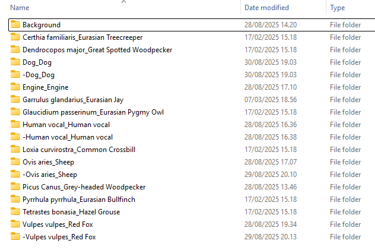
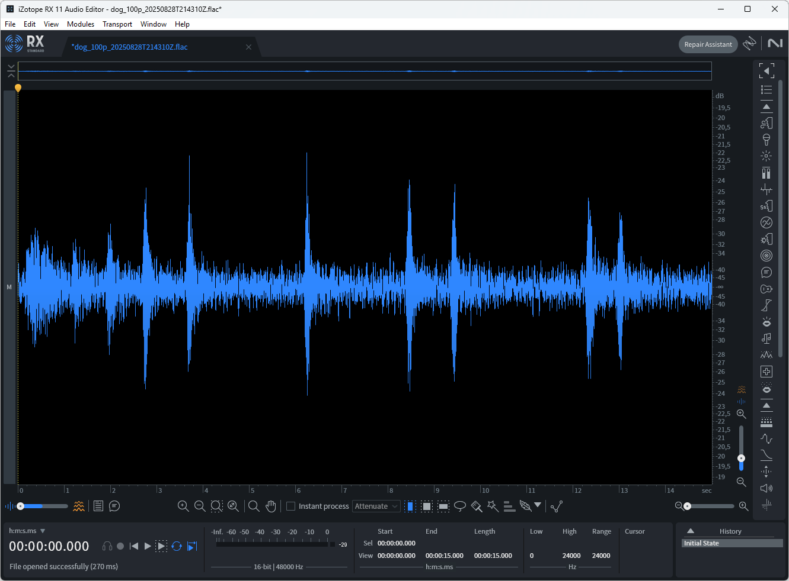
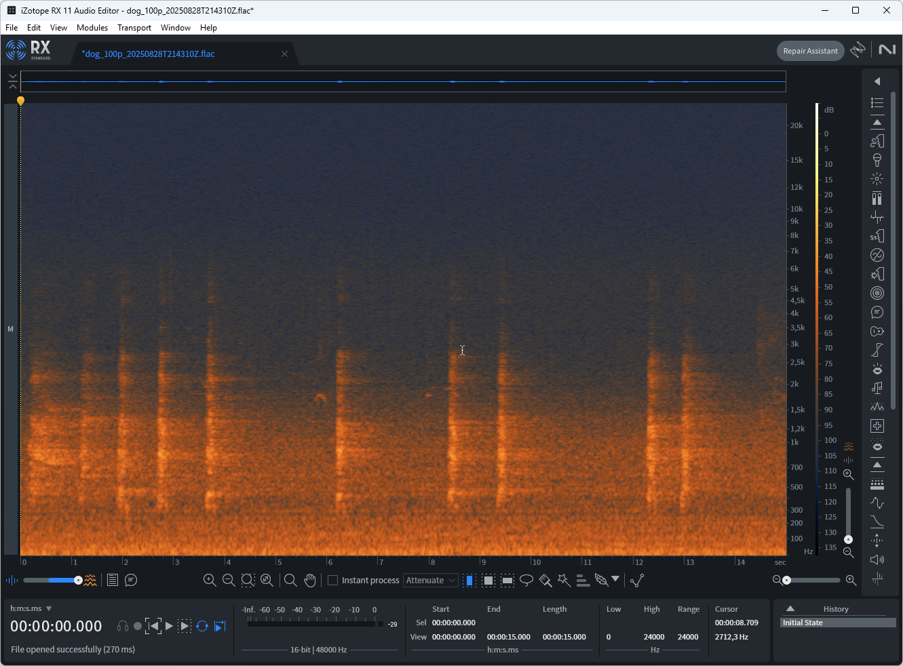
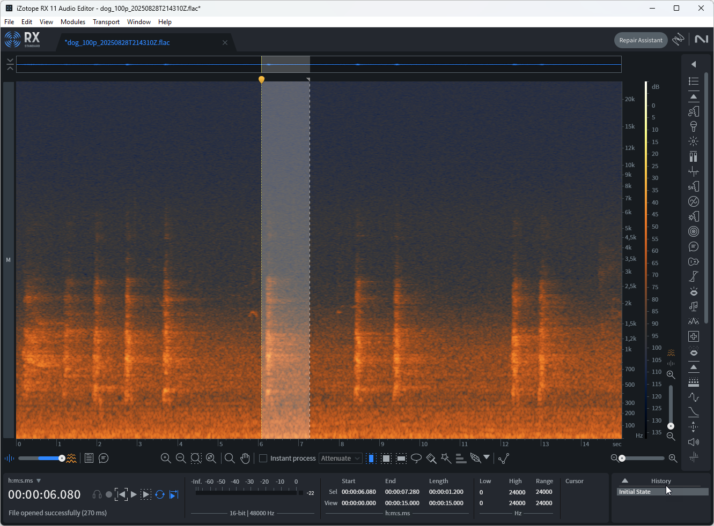
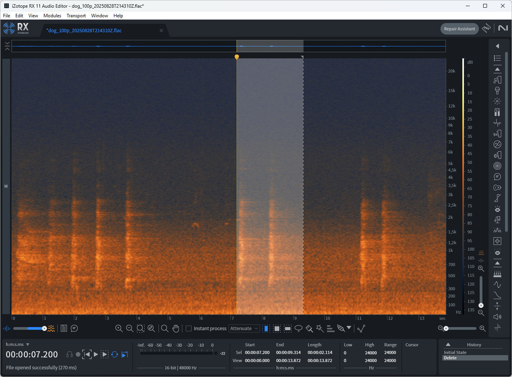
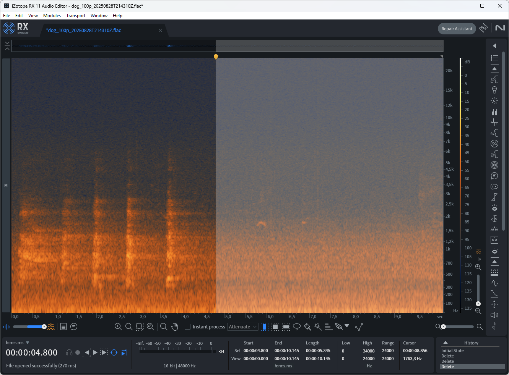
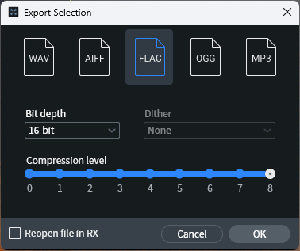
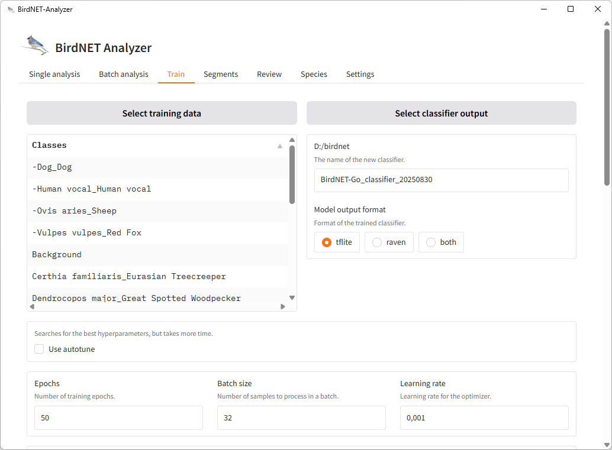
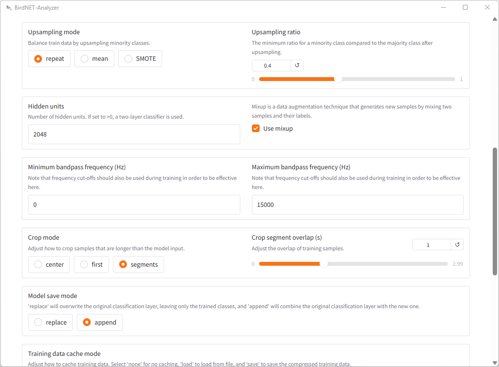

# Training a Custom BirdNET Classifier

This guide explains how to train a custom BirdNET classifier for detecting specific sounds using the BirdNET Analyzer GUI. In this example, we'll demonstrate training a classifier specifically for dog bark sounds. By improving dog bark detection, we reduce the possibility of false positive matches where dog barks might be incorrectly identified as bird sounds (such as owl hoots or other similar vocalizations). The same process applies to any custom sound classification.

## Prerequisites

- BirdNET Analyzer 1.5.1 GUI
- Audio editing software (Audacity, Izotope RX11, or similar)
- Audio samples containing target sounds (positive matches)
- Audio samples without target sounds (negative matches)

## Overview

Training a custom BirdNET classifier requires two types of audio data:
- **Positive matches**: Audio segments containing the target sound you want to detect
- **Negative matches**: Audio segments that do not contain the target sound

The quality of your classifier depends heavily on having diverse and representative samples of both positive and negative matches.

## Understanding BirdNET's Training Folder Structure

### Folder Structure Requirements

BirdNET requires a specific folder structure for training data. Each folder represents a class that the AI model will learn to recognize. Folder names follow the pattern: `ScientificName_CommonName`

### The Critical Background Folder

**The most important folder for a well-performing classifier is the `Background` (or `Noise`) folder.** This special folder contains ambient audio samples that should NOT be matched to any specific class. It teaches the model what constitutes "nothing of interest" in your environment.

The Background folder should contain:
- Background hiss and static
- Wind sounds
- Rain and weather sounds
- Traffic noise
- General environmental ambience
- Any other sounds that you want BirdNET to ignore

**This Background class is essential** - without it, the classifier will struggle to distinguish between actual target sounds and random environmental noise, leading to many false positives.

### Complete Folder Structure Example

Here's an example of a complete training data folder structure with multiple classes:

The structure includes:
- **Background**: Ambient sounds that should not trigger any detection
- **Target classes**: Each folder named as `ScientificName_CommonName`
  - `Dog_Dog` - Dog bark sounds
  - `Garrulus glandarius_Eurasian Jay` - Eurasian Jay calls
  - `Dendrocopos major_Great Spotted Woodpecker` - Woodpecker sounds
  - `Certhia familiaris_Eurasian Treecreeper` - Treecreeper calls
  - `Engine_Engine` - Engine sounds
  - `Human vocal_Human vocal` - Human vocalizations
  - `Loxia curvirostra_Common Crossbill` - Crossbill calls
  - `Ovis aries_Sheep` - Sheep sounds
  - `Picus Canus_Grey-headed Woodpecker` - Grey-headed Woodpecker calls
  - `Pyrrhula pyrrhula_Eurasian Bullfinch` - Bullfinch calls
  - `Tetrastes bonasia_Hazel Grouse` - Hazel Grouse calls
  - `Vulpes vulpes_Red Fox` - Fox vocalizations
  - And many more...

Note: You can also create specific negative match folders using the minus prefix (e.g., `-Dog_Dog`, `-Ovis aries_Sheep`) for targeted negative samples of a particular class, though the Background folder serves as the universal negative match repository.

### File Organization Guidelines

For each class folder:
- Save audio clips containing the target sound in the appropriately named folder
- **Critical**: Populate the Background folder with diverse ambient sounds from your recording environment
- BirdNET Analyzer supports a wide range of audio formats - you can mix formats like AAC, MP3, WAV, FLAC, etc. within and across folders
- Ensure each folder has sufficient samples (minimum 10-20 clips recommended)

*Personal preference note: I use uncompressed FLAC files as they provide the best flexibility for audio post-processing (noise suppression, filtering, etc.) if needed later. However, compressed formats like MP3 and AAC work perfectly fine for training.*

## Step 1: Prepare Your Audio Data

### Using Spectrogram View

Most audio editors display audio as waveforms by default:

However, for this task, you should use **spectrogram view** instead. The spectrogram provides a visual representation of frequency content over time, making it easier to identify and isolate specific sounds:

In the spectrogram view, different sounds appear as distinct patterns:
- Dog barks appear as vertical bands with specific frequency characteristics
- Background noise has different visual patterns
- This visual distinction helps in accurately separating positive and negative samples

### Processing Audio Files

For this example, we'll process 15-second audio clips containing dog barks:

1. **Load your audio file** into your audio editor (Audacity or Izotope RX11)
2. **Switch to spectrogram view** to better visualize the sound patterns
3. **Identify the target sounds** (dog barks in this example)

### Isolating Negative Matches

The negative matches are all portions of the audio that do NOT contain your target sound:

1. **Identify dog barks** in the spectrogram view

2. **Delete the dog bark segments** to isolate only the background/negative audio

3. **Combine the remaining segments** into a continuous audio track without any dog barks - in this example selected part will be exported as negative sample

4. **Export the audio** using your audio editor's export function

5. **Save to the negative folder** (e.g., `-Dog_Dog` or `Background` folder)

## Step 2: Configure BirdNET Analyzer

Launch BirdNET Analyzer 1.5.1 GUI and navigate to the **Train** tab:

### Training Configuration

Configure the following settings:

| Parameter | Value | Description |
|-----------|-------|-------------|
| **Input folder** | Select your training data folder | Contains both positive and negative sample folders |
| **Output folder** | Choose destination for classifier | Where the trained model will be saved |
| **Classifier name** | e.g., "my_custom_classifier" | Name for your custom classifier file |
| **Upsampling ratio** | 0.4 | Balances class distribution |
| **Hidden units** | 2048 | Network complexity parameter |
| **Use mixup** | Enabled | Data augmentation technique |
| **Crop mode** | Segments | Allows training with continuous audio |
| **Overlap** | 1.0 | Increases training data through overlapping |
| **Model save** | Append | Adds to existing model |

### Key Parameters Explained

- **Segments mode**: Allows training with long continuous audio clips. BirdNET automatically segments input audio into 3-second chunks for learning
- **Overlap (1.0)**: Creates slightly overlapping segments from the audio, effectively increasing training data and potentially improving the learning process
- **Upsampling ratio (0.4)**: Helps balance the dataset when you have unequal amounts of positive and negative samples
- **Hidden units (2048)**: Determines the complexity of the neural network; higher values may capture more complex patterns but require more training data
- **Model save - Append**: This critical setting means your training data will augment (be appended to) the default BirdNET classifier rather than replacing it. This creates new classes/labels in the model while preserving all existing bird species detection capabilities

**Important Note about Append Mode**: When using append mode, your custom classes (like `Dog_Dog`) are added as new labels to the existing BirdNET model. If a label already exists in the base model, BirdNET-Go will intelligently handle matching labels as a single species, preventing duplicate detections.

*Note: These values were determined through trial and error and I have found that they work well for classifiers used with BirdNET-Go in non-scientific setting*

## Step 3: Train the Classifier

Once all settings are configured:

1. Click the **Train** button
2. Monitor the training progress in the output window
3. Wait for training to complete

The training process will:
- Load and preprocess your audio data
- Segment the audio into 3-second chunks
- Train the neural network on these segments
- Save the resulting classifier model

## Step 4: Verify Results

After training completes, you'll have a custom classifier file that can be used with BirdNET to detect your target sounds.

### Testing Your Classifier

1. Load the newly created classifier in BirdNET
2. Test it with new audio samples
3. Adjust training parameters and retrain if needed

## Tips for Better Results

1. **Diverse samples**: Include various examples of your target sound in different conditions
2. **Quality negative samples**: Ensure negative samples represent the typical environment where detection will occur
3. **Balanced dataset**: Try to have roughly equal amounts of positive and negative training data
4. **Iterative refinement**: Test your classifier and retrain with adjusted parameters or additional data as needed
5. **Audio quality**: Use high-quality recordings when possible (at least 16kHz sample rate)
6. **Background folder importance**: Always include a well-populated Background folder with diverse ambient sounds

## Troubleshooting

- **Poor detection accuracy**: Add more diverse training samples or adjust the upsampling ratio
- **Too many false positives**: Include more representative negative samples in the Background folder
- **Training fails**: Check audio file formats (BirdNET supports WAV, MP3, AAC, FLAC, and many others) and folder structure
- **Overfitting**: Reduce hidden units or add more training data variety

## Conclusion

Training a custom BirdNET classifier requires careful preparation of audio data and thoughtful configuration of training parameters. The key to success is having representative samples of both what you want to detect (positive matches) and what you want to ignore (negative matches). The Background folder plays a crucial role in teaching the model to distinguish between target sounds and ambient noise. Through iterative training and testing, you can create effective classifiers for various sound detection tasks beyond bird identification.