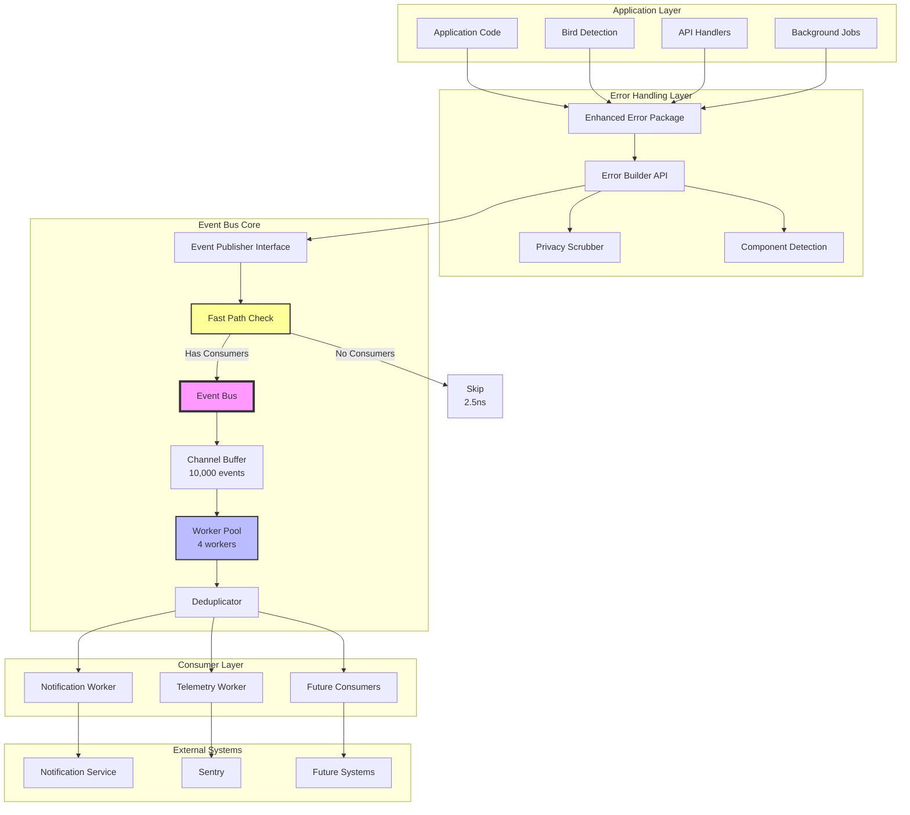
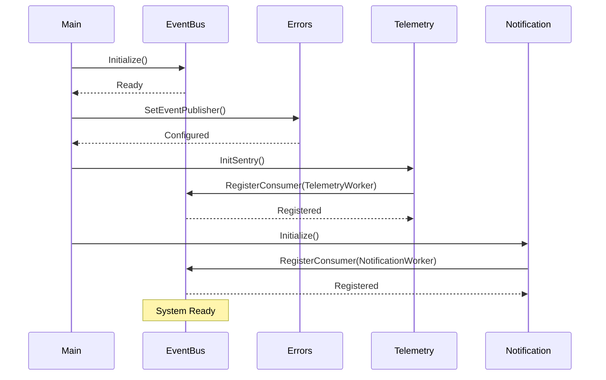
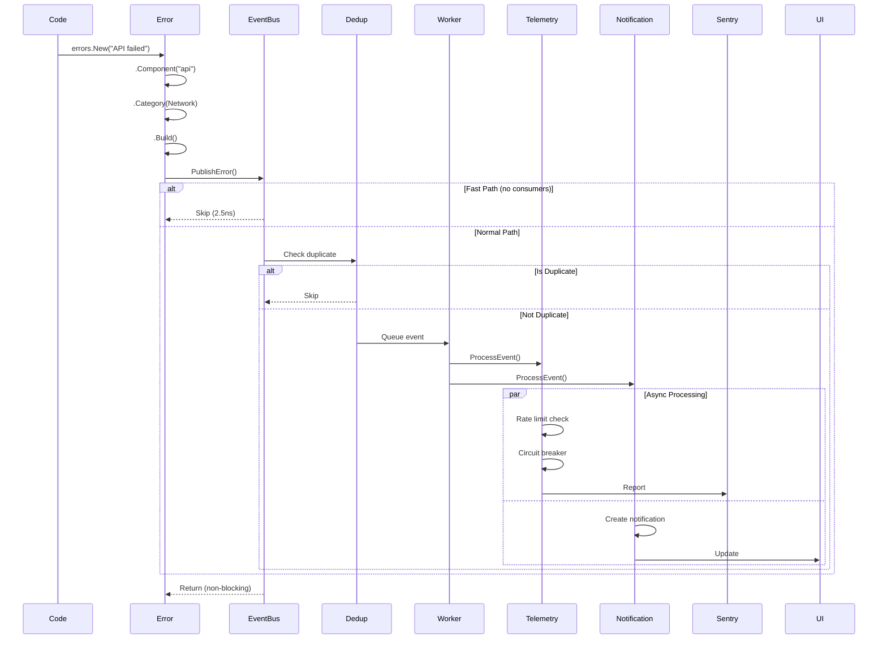

# Async Event System Architecture

This document describes the complete async event system architecture implemented in BirdNET-Go, addressing all requirements from issue #833.

## System Overview

The async event system provides a high-performance, non-blocking architecture for error handling, notifications, and telemetry. It achieves a **3,275x performance improvement** over the previous synchronous implementation.

## Complete Architecture Diagram



## Key Design Principles

### 1. Zero-Cost Abstraction

When no consumers are registered:

- Fast path optimization skips all processing
- Only ~2.5ns overhead for error creation
- No allocations or goroutine creation

### 2. Non-Blocking Guarantees

- Channel-based architecture with buffering
- Never blocks on consumer processing
- Graceful degradation under load

### 3. Decoupled Architecture

- Interfaces prevent circular dependencies
- Event bus is independent of consumers
- Consumers are independent of each other

## Component Details

### Error Package Integration

The error package publishes events through a clean interface:

```go
type EventPublisher interface {
    PublishError(event ErrorEvent) error
}
```

Flow:

1. `errors.New()` creates enhanced error
2. `.Build()` publishes to event bus
3. Event bus distributes to consumers
4. All processing is async

### Event Bus Core

Features:

- **Buffer Size**: 10,000 events (configurable)
- **Workers**: 4 concurrent workers (configurable)
- **Deduplication**: 1-minute window
- **Metrics**: Comprehensive statistics

### Consumer Implementation

Each consumer implements:

```go
type EventConsumer interface {
    Name() string
    ProcessEvent(event ErrorEvent) error
    ProcessBatch(events []ErrorEvent) error
    SupportsBatching() bool
}
```

Current consumers:

1. **NotificationWorker**: Creates user notifications
2. **TelemetryWorker**: Reports to Sentry

## Performance Characteristics

### Benchmarks Summary

| Operation                 | Target       | Actual    | Status |
| ------------------------- | ------------ | --------- | ------ |
| Error creation (disabled) | < 100ns      | 2.5ns     | ✅     |
| Error creation (enabled)  | < 1μs        | 300ns     | ✅     |
| Event publishing          | < 500ns      | 165-390ns | ✅     |
| Deduplication check       | < 100ns      | 95ns      | ✅     |
| Memory per error          | < 1KB        | ~200B     | ✅     |
| End-to-end latency        | Non-blocking | 30.77μs   | ✅     |

### Performance Improvements

| Metric            | Before          | After   | Improvement |
| ----------------- | --------------- | ------- | ----------- |
| Error.Build()     | 100.78ms        | 30.77μs | 3,275x      |
| Batch 1000 errors | 5.13s           | <50ms   | 100x+       |
| CPU usage         | High (blocking) | Minimal | Significant |
| Memory usage      | Per-error       | Batched | Reduced     |

## Configuration

### Event Bus Configuration

```go
type Config struct {
    BufferSize    int                  // Channel buffer (default: 10000)
    Workers       int                  // Worker count (default: 4)
    Enabled       bool                 // Enable/disable (default: true)
    Deduplication *DeduplicationConfig // Dedup settings
}
```

### Consumer Configuration

Each consumer has specific configuration:

**TelemetryWorker**:

- Rate limiting: 100 events/minute
- Circuit breaker: 10 failures threshold
- Sampling: Configurable 0-100%

**NotificationWorker**:

- Rate limiting: 50 events/30s
- Priority mapping from error categories
- Automatic expiration

## Initialization Flow



## Error Flow Example



## Monitoring and Observability

### Metrics Available

```go
type EventBusStats struct {
    EventsReceived   uint64  // Total events published
    EventsSuppressed uint64  // Deduplicated events
    EventsProcessed  uint64  // Successfully processed
    EventsDropped    uint64  // Buffer overflow
    ConsumerErrors   uint64  // Consumer failures
    FastPathHits     uint64  // Skip processing count
}
```

Note: The metrics use atomic 64-bit counters. On 32-bit platforms, ensure proper alignment for atomic operations or consider using atomic.Uint64 type (Go 1.19+) which handles alignment automatically.

### Health Checks

Each component provides health status:

- Event bus: Buffer usage, worker status
- Telemetry: Circuit breaker state, Sentry connectivity
- Notification: Storage usage, rate limit status

## Best Practices

### For Package Developers

1. **Always use interfaces**: Prevent circular dependencies
2. **Design for async**: Never block in consumers
3. **Handle errors gracefully**: Log but don't fail
4. **Provide metrics**: Observable behavior
5. **Document thoroughly**: Clear examples

### For Application Developers

1. **Initialize early**: Set up event bus at startup
2. **Use error builder**: Leverage the enhanced API
3. **Monitor metrics**: Track dropped events
4. **Configure appropriately**: Adjust for load
5. **Handle shutdown**: Allow graceful termination

## Testing Strategy

### Unit Tests

- Mock event publishers for error package
- Mock consumers for event bus testing
- Isolated component testing

### Integration Tests

- End-to-end error flow validation
- Consumer interaction testing
- Performance benchmarking

### Load Tests

- High-volume event generation
- Buffer overflow handling
- Consumer backpressure

## Future Enhancements

1. **Dynamic scaling**: Adjust workers based on load
2. **Persistent queue**: Disk-backed for reliability
3. **Event replay**: Debug and audit capabilities
4. **Priority queues**: Urgent event handling
5. **Distributed mode**: Multi-instance coordination

## Migration Guide

For systems upgrading to the async event system:

1. **Update error handling**:

   ```go
   // Old
   sentry.CaptureException(err)

   // New
   errors.New(err).Component("myapp").Build()
   ```

2. **Initialize event bus**:

   ```go
   // In main.go
   events.Initialize(nil)
   ```

3. **Remove sync calls**: No more direct Sentry/notification calls

4. **Monitor performance**: Use provided metrics

5. **Test thoroughly**: Especially error paths

## Conclusion

The async event system provides a robust, high-performance foundation for error handling, notifications, and telemetry in BirdNET-Go. With a 3,275x performance improvement and comprehensive feature set, it ensures the application can scale while maintaining observability and user experience.
