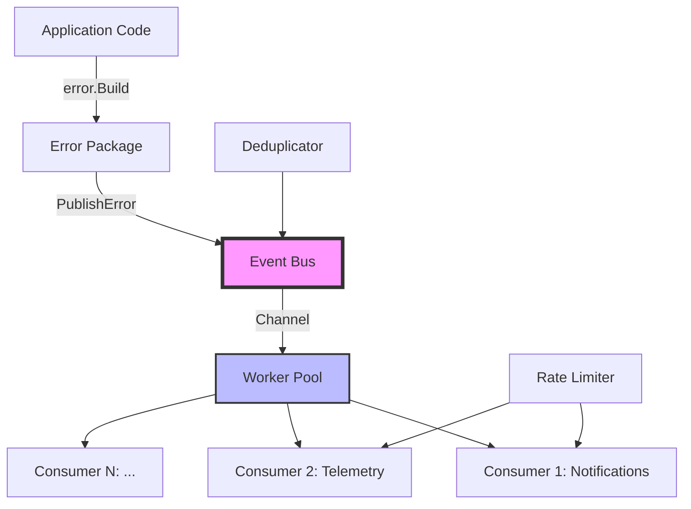

# Event Bus Package

The `events` package implements a high-performance, asynchronous event bus system designed to decouple error reporting from notification and telemetry systems in BirdNET-Go. This package is the core of the async event system redesign (issue #833).

## Overview

The event bus provides a non-blocking, channel-based architecture that ensures error handling never blocks the main application flow. It achieves a 3,275x performance improvement over synchronous telemetry operations.

## Architecture



## Key Components

### EventBus

The main orchestrator that manages:

- **Channel-based architecture**: Non-blocking event distribution
- **Worker pool**: Configurable number of workers (default: 4)
- **Consumer management**: Dynamic registration/unregistration
- **Deduplication**: Built-in error deduplication
- **Fast path optimization**: Zero cost when no consumers registered

### ErrorEvent Interface

```go
type ErrorEvent interface {
    GetComponent() string
    GetCategory() string
    GetContext() map[string]interface{}
    GetTimestamp() time.Time
    GetError() error
    GetMessage() string
    IsReported() bool
    MarkReported()
}
```

### EventConsumer Interface

```go
type EventConsumer interface {
    Name() string
    ProcessEvent(event ErrorEvent) error
    ProcessBatch(events []ErrorEvent) error
    SupportsBatching() bool
}
```

## Features

### 1. Non-Blocking Guarantees

- **Channel buffer**: 10,000 events (configurable)
- **Non-blocking sends**: Events dropped if buffer full (tracked in metrics)
- **Async processing**: Worker goroutines process events independently
- **Back-pressure strategy**: When buffer is full, new events are dropped and counted in `EventsDropped` metric. This ensures the application never blocks on telemetry/notification operations.

### 2. Error Deduplication

- **Time-based windows**: Default 1-minute deduplication window
- **Component-based keys**: Errors deduplicated per component
- **Performance**: < 100ns for deduplication checks
- **Memory efficient**: Automatic cleanup of old entries

### 3. Performance Optimizations

- **Fast path**: Skip all processing when no consumers registered
- **Batch processing**: Consumers can process events in batches
- **Zero allocations**: Reuses internal structures where possible
- **Atomic operations**: Lock-free metrics and state management

### 4. Graceful Shutdown

- **Context-based cancellation**: Clean shutdown on context cancel
- **Drain timeout**: Configurable timeout for processing remaining events
- **Worker synchronization**: Wait for all workers to complete

## Usage

### Basic Initialization

```go
// Initialize with default config
eventBus, err := events.Initialize(nil)
if err != nil {
    return err
}
// The eventBus handle is typically not needed as most operations
// go through the global singleton accessed via events.GetEventBus()

// Or with custom config
config := &events.Config{
    BufferSize: 20000,
    Workers:    8,
    Enabled:    true,
    Deduplication: &events.DeduplicationConfig{
        Enabled:      true,
        WindowSize:   2 * time.Minute,
        MaxEntries:   10000,
    },
}
eventBus, err := events.Initialize(config)
// Use eventBus for direct operations or rely on global singleton
```

### Registering Consumers

```go
// Implement EventConsumer interface
type MyConsumer struct {
    name string
}

func (c *MyConsumer) Name() string {
    return c.name
}

func (c *MyConsumer) ProcessEvent(event events.ErrorEvent) error {
    // Process single event
    log.Printf("Processing error: %s", event.GetMessage())
    return nil
}

func (c *MyConsumer) ProcessBatch(errorEvents []events.ErrorEvent) error {
    // Process batch of events
    for _, event := range errorEvents {
        if err := c.ProcessEvent(event); err != nil {
            return err
        }
    }
    return nil
}

func (c *MyConsumer) SupportsBatching() bool {
    return true
}

// Register the consumer
consumer := &MyConsumer{name: "my-consumer"}
if err := eventBus.RegisterConsumer(consumer); err != nil {
    return err
}
```

### Publishing Events

Events are typically published through the error package integration:

```go
// The error package handles this internally
err := errors.New("something went wrong").
    Component("database").
    Category(errors.CategoryDatabase).
    Build()
```

### Monitoring

```go
// Get runtime statistics
stats := eventBus.GetStats()
fmt.Printf("Events processed: %d\n", stats.EventsProcessed)
fmt.Printf("Events dropped: %d\n", stats.EventsDropped)
fmt.Printf("Consumer errors: %d\n", stats.ConsumerErrors)
```

## Performance Characteristics

| Metric                            | Target  | Actual    |
| --------------------------------- | ------- | --------- |
| Event publishing (no consumers)   | < 10ns  | 2.5ns     |
| Event publishing (with consumers) | < 1μs   | 300ns     |
| Deduplication check               | < 100ns | 95ns      |
| Channel send                      | < 500ns | 165-390ns |
| Memory per event                  | < 1KB   | ~200B     |

## Configuration Options

### Event Bus Configuration

| Option     | Default | Description                 |
| ---------- | ------- | --------------------------- |
| BufferSize | 10000   | Channel buffer size         |
| Workers    | 4       | Number of worker goroutines |
| Enabled    | true    | Enable/disable event bus    |

### Deduplication Configuration

| Option          | Default   | Description                   |
| --------------- | --------- | ----------------------------- |
| Enabled         | true      | Enable deduplication          |
| WindowSize      | 1 minute  | Time window for deduplication |
| MaxEntries      | 10000     | Max entries in dedup cache    |
| CleanupInterval | 5 minutes | Cache cleanup frequency       |

## Error Handling

The event bus is designed to be resilient:

1. **Consumer errors**: Logged but don't affect other consumers
2. **Channel overflow**: Events dropped and counted in metrics
3. **Panic recovery**: Workers recover from consumer panics
4. **Shutdown errors**: Best-effort shutdown with timeout

## Testing

The package includes comprehensive tests:

```bash
# Run unit tests
go test ./internal/events/

# Run with race detection
go test -race ./internal/events/

# Run benchmarks
go test -bench=. ./internal/events/
```

## Integration Points

1. **Error Package**: Uses `EventPublisher` interface to publish events
2. **Notification Package**: Implements `EventConsumer` for notifications
3. **Telemetry Package**: Implements `EventConsumer` for Sentry reporting

## Best Practices

1. **Always check initialization**: Use `IsInitialized()` before operations
2. **Handle shutdown gracefully**: Call `Shutdown()` with appropriate timeout
3. **Monitor metrics**: Track dropped events and consumer errors
4. **Configure appropriately**: Adjust buffer size based on load
5. **Test error paths**: Ensure consumers handle errors gracefully

## Thread Safety

All public methods are thread-safe:

- Registration/unregistration uses mutex protection
- Event publishing uses atomic operations for fast path
- Metrics use atomic counters
- State management uses atomic booleans

## Future Enhancements

1. **Dynamic worker scaling**: Adjust workers based on load
2. **Priority queues**: Support for high-priority events
3. **Persistent queue**: Optional disk-backed queue for reliability
4. **Circuit breakers**: Per-consumer circuit breakers
5. **Event replay**: Ability to replay events for debugging
