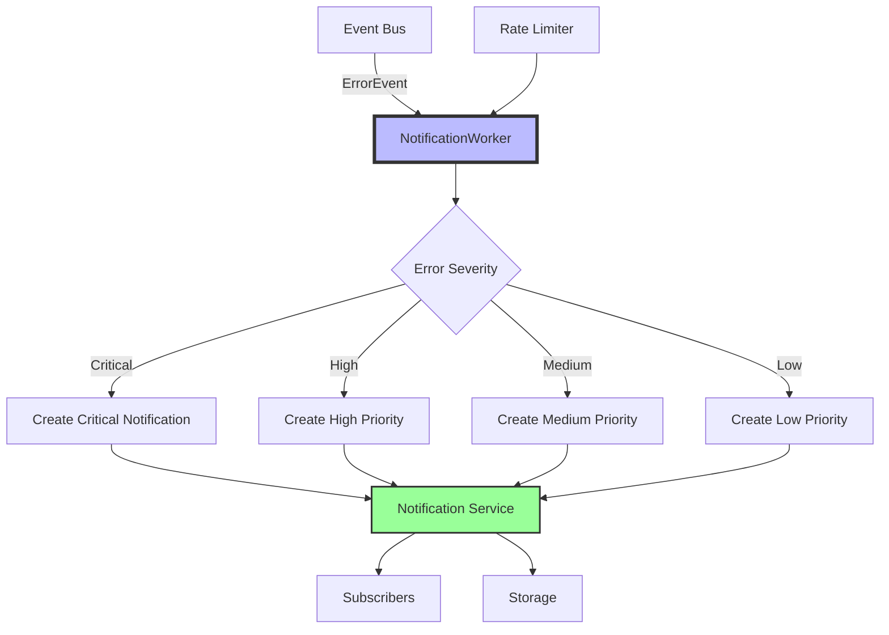

# Notification Package

The notification package provides a centralized system for managing application notifications, including system alerts, errors, and important bird detection events.

## Features

- **Multiple notification types**: Error, Warning, Info, Detection, System
- **Priority levels**: Critical, High, Medium, Low
- **Rate limiting**: Prevents notification spam
- **Real-time broadcasting**: Subscribe to notifications via channels
- **In-memory storage**: Fast access with configurable size limits
- **Automatic cleanup**: Expired notifications are removed automatically
- **Thread-safe**: Safe for concurrent use

## Usage

### Initialization

Initialize the notification service at application startup:

```go
import "github.com/tphakala/birdnet-go/internal/notification"

// Use default configuration
notification.Initialize(nil)

// Or with custom configuration
config := &notification.ServiceConfig{
    MaxNotifications:   2000,
    CleanupInterval:    10 * time.Minute,
    RateLimitWindow:    30 * time.Second,
    RateLimitMaxEvents: 50,
}
notification.Initialize(config)
```

### Creating Notifications

Use the helper functions for common scenarios:

```go
// Error notification from an error
notification.NotifyError(err)

// System alert
notification.NotifySystemAlert(notification.PriorityHigh, "High CPU Usage", "CPU usage is above 80%")

// Bird detection
notification.NotifyDetection("Northern Cardinal", 0.95, map[string]interface{}{
    "location": "backyard",
    "time_of_day": "morning",
})

// Integration failure
notification.NotifyIntegrationFailure("BirdWeather", err)

// Resource alert
notification.NotifyResourceAlert("Memory", 85.5, 80.0, "%")

// Info message
notification.NotifyInfo("Update Available", "A new version of BirdNET-Go is available")

// Warning
notification.NotifyWarning("audio", "Audio Device Changed", "Audio input device has been switched")
```

### Direct Service Usage

For more control, use the service directly:

```go
service := notification.GetService()

// Create a notification with metadata
notif, err := service.Create(
    notification.TypeWarning,
    notification.PriorityMedium,
    "Disk Space Low",
    "Only 10GB of disk space remaining",
)

if err == nil && notif != nil {
    notif.WithComponent("storage").
        WithMetadata("disk_free_gb", 10).
        WithMetadata("disk_total_gb", 100).
        WithExpiry(1 * time.Hour)

    service.store.Update(notif)
}
```

### Subscribing to Notifications

Subscribe to receive real-time notifications:

```go
service := notification.GetService()
ch := service.Subscribe()
defer service.Unsubscribe(ch)

go func() {
    for notif := range ch {
        fmt.Printf("New notification: %s - %s\n", notif.Title, notif.Message)
    }
}()
```

### Querying Notifications

List and filter notifications:

```go
service := notification.GetService()

// Get all unread notifications
unreadNotifs, _ := service.List(&notification.FilterOptions{
    Status: []notification.Status{notification.StatusUnread},
})

// Get critical errors from the last hour
since := time.Now().Add(-1 * time.Hour)
criticalErrors, _ := service.List(&notification.FilterOptions{
    Types:      []notification.Type{notification.TypeError},
    Priorities: []notification.Priority{notification.PriorityCritical},
    Since:      &since,
})

// Get unread count
count, _ := service.GetUnreadCount()
```

### Managing Notification Status

```go
service := notification.GetService()

// Mark as read
service.MarkAsRead(notificationID)

// Mark as acknowledged
service.MarkAsAcknowledged(notificationID)

// Delete a notification
service.Delete(notificationID)
```

## Integration with Error Handler

The notification system integrates seamlessly with the enhanced error handler:

```go
// In error handling code
err := errors.New("database connection failed").
    Component("database").
    Category(errors.CategoryDatabase).
    Build()

// This will automatically create an appropriate notification
notification.NotifyError(err)
```

## Best Practices

1. **Initialize early**: Set up the notification service during application startup
2. **Use appropriate priorities**: Reserve Critical for urgent issues requiring immediate attention
3. **Set expiration times**: Use `WithExpiry()` for temporary notifications
4. **Add metadata**: Include relevant context in metadata for debugging
5. **Handle rate limits**: Check for rate limit errors when creating many notifications
6. **Clean up subscribers**: Always unsubscribe channels when done to prevent leaks

## Notification Types Guide

- **TypeError**: System errors, failures, exceptions
- **TypeWarning**: Potential issues, degraded performance, threshold violations
- **TypeInfo**: General information, status updates, confirmations
- **TypeDetection**: Bird detection events, rare species alerts
- **TypeSystem**: System status changes, startup/shutdown events

## Priority Levels Guide

- **PriorityCritical**: Immediate action required (system failure, data loss risk)
- **PriorityHigh**: Important but not urgent (service disruption, repeated failures)
- **PriorityMedium**: Normal priority (warnings, standard errors)
- **PriorityLow**: Informational only (status updates, confirmations)

## Event Bus Integration

The notification package is fully integrated with the async event bus system for automatic error notifications.

### Architecture



### NotificationWorker

The notification package implements an `EventConsumer` that:

- Receives error events from the event bus
- Converts errors to appropriate notifications
- Applies rate limiting to prevent spam
- Maps error categories to notification priorities

### Automatic Error Notifications

When errors are created through the enhanced error system, they automatically flow to notifications:

```go
// This error...
err := errors.New("API rate limit exceeded").
    Component("birdweather").
    Category(errors.CategoryRateLimit).
    Build()

// ...automatically creates a notification with:
// - Type: TypeError
// - Priority: Based on error category
// - Title: Component-specific title
// - Message: Error message with context
```

### Priority Mapping

Error categories are mapped to notification priorities:

| Error Category       | Notification Priority |
| -------------------- | --------------------- |
| Critical errors      | Critical              |
| Network/API failures | High                  |
| Validation errors    | Medium                |
| Info/Debug           | Low                   |

### Performance Impact

The event bus integration ensures:

- **Non-blocking**: Notifications never block error creation
- **Batching**: Multiple errors can be batched
- **Deduplication**: Prevents notification spam
- **Async processing**: No impact on main code flow

### Configuration

The notification worker respects the service configuration:

```go
// Rate limiting is applied per the service config
config := &notification.ServiceConfig{
    RateLimitWindow:    30 * time.Second,
    RateLimitMaxEvents: 50,
}
```

### Monitoring

Track notification worker performance:

```go
// Through event bus stats
stats := events.GetEventBus().GetStats()

// Or through notification service metrics
service := notification.GetService()
unreadCount, _ := service.GetUnreadCount()
```

### Best Practices with Event Bus

1. **Let errors flow naturally**: Don't manually create notifications for errors
2. **Set proper error categories**: They determine notification priority
3. **Monitor dropped events**: May indicate rate limiting
4. **Use error context**: It becomes notification metadata
5. **Handle initialization order**: Event bus must be initialized first

## Customizable Notification Templates

New species detection notifications support customizable templates configured in `config.yaml`.

### Configuration

```yaml
notification:
  templates:
    newspecies:
      title: "New Species: {{.CommonName}}"
      message: "First detection of {{.CommonName}} ({{.ScientificName}}) with {{.ConfidencePercent}}% confidence at {{.DetectionTime}}. View: {{.DetectionURL}}"
```

### Available Template Variables

| Variable | Description | Example |
|----------|-------------|---------|
| `{{.CommonName}}` | Bird common name | "American Robin" |
| `{{.ScientificName}}` | Scientific name | "Turdus migratorius" |
| `{{.Confidence}}` | Confidence as float (0-1) | 0.92 |
| `{{.ConfidencePercent}}` | Confidence as percentage | "92" |
| `{{.DetectionTime}}` | Time of detection | "15:04:05" or "3:04:05 PM" |
| `{{.DetectionDate}}` | Date of detection | "2025-10-05" |
| `{{.Latitude}}` | GPS latitude | 45.123456 |
| `{{.Longitude}}` | GPS longitude | -122.987654 |
| `{{.Location}}` | Formatted coordinates | "45.123456, -122.987654" |
| `{{.DetectionURL}}` | Link to detection details | "http://host:port/ui/detections/123" |
| `{{.ImageURL}}` | Link to species image | "http://host:port/api/v2/media/species-image?..." |
| `{{.DaysSinceFirstSeen}}` | Days since first detection | 0 for new species |

### Template Examples

```yaml
# Simple notification
notification:
  templates:
    newspecies:
      title: "New: {{.CommonName}}"
      message: "Detected {{.CommonName}} at {{.DetectionTime}}"

# Detailed notification with GPS
notification:
  templates:
    newspecies:
      title: "🐦 New Species Alert"
      message: "{{.CommonName}} ({{.ScientificName}}) detected with {{.ConfidencePercent}}% confidence at {{.Location}}. Time: {{.DetectionTime}}"

# Notification with link
notification:
  templates:
    newspecies:
      title: "New Species: {{.CommonName}}"
      message: "First detection! View details: {{.DetectionURL}}"
```

### Error Handling

- If templates fail to render, notifications fall back to default messages
- Invalid template syntax is logged but doesn't prevent notifications
- Template variables are populated from detection event data (no database queries)
