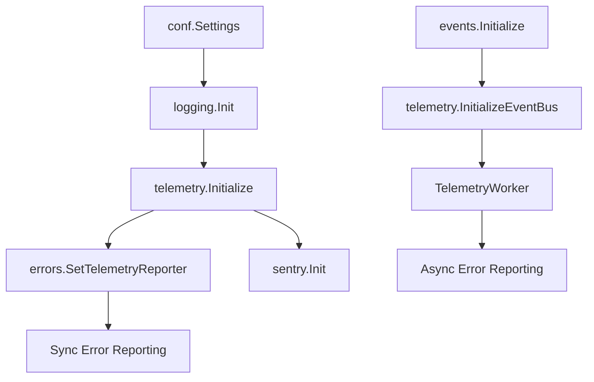

# Telemetry Initialization Order Documentation

## Overview

The telemetry system has a complex initialization sequence designed to avoid circular dependencies and deadlocks while providing both synchronous and asynchronous error reporting capabilities.

## Initialization Phases

### Phase 1: Early Initialization (main.go)

1. **Configuration Loading** - Load settings from config file
2. **System ID Generation** - Create or load unique system identifier
3. **Logging Initialization** - Set up structured logging
4. **Telemetry Initialization** - Initialize telemetry coordinator
   - Error integration (synchronous)
   - Sentry client (if enabled)
   - Deferred event bus integration

### Phase 2: Service Initialization

1. **Core Services** - Initialize application services
2. **Event Bus** - Initialize async event processing
3. **Notification Services** - Set up notification workers

### Phase 3: Late Initialization (realtime.go)

1. **Event Bus Integration** - Connect telemetry to event bus
2. **Telemetry Worker** - Start async error processing
3. **Enable Fast Path** - Activate optimized error reporting

## Component Dependencies



## Key Components

### InitManager

- Coordinates safe initialization using sync.Once
- Tracks component states (not started, in progress, completed, failed)
- Provides health checks and timeout handling
- Prevents race conditions during startup

### InitCoordinator

- Implements ordered initialization sequence
- Handles dependency checking
- Provides graceful shutdown capabilities
- Manages global initialization state

### Deferred Initialization

- Event bus integration happens after core services
- Prevents circular dependencies
- Allows early error reporting before full async setup

## Thread Safety

All initialization operations are protected by:

- `sync.Once` for singleton initialization
- Atomic operations for state tracking
- Mutexes for shared resource access
- Timeout contexts for bounded operations

## Error Handling

The system is designed to be resilient:

- Telemetry failures don't stop application startup
- Each component can fail independently
- Health checks provide visibility into component states
- Graceful degradation when telemetry is unavailable

## Debugging Initialization Issues

1. Check component states:

   ```go
   status := telemetry.GetHealthStatus()
   ```

2. Review initialization logs:
   - Look for "initializing" messages
   - Check for timeout warnings
   - Verify completion messages

3. Common issues:
   - Circular dependencies → Use deferred initialization
   - Race conditions → Check sync.Once usage
   - Timeouts → Increase initialization timeout
   - Missing dependencies → Verify initialization order
