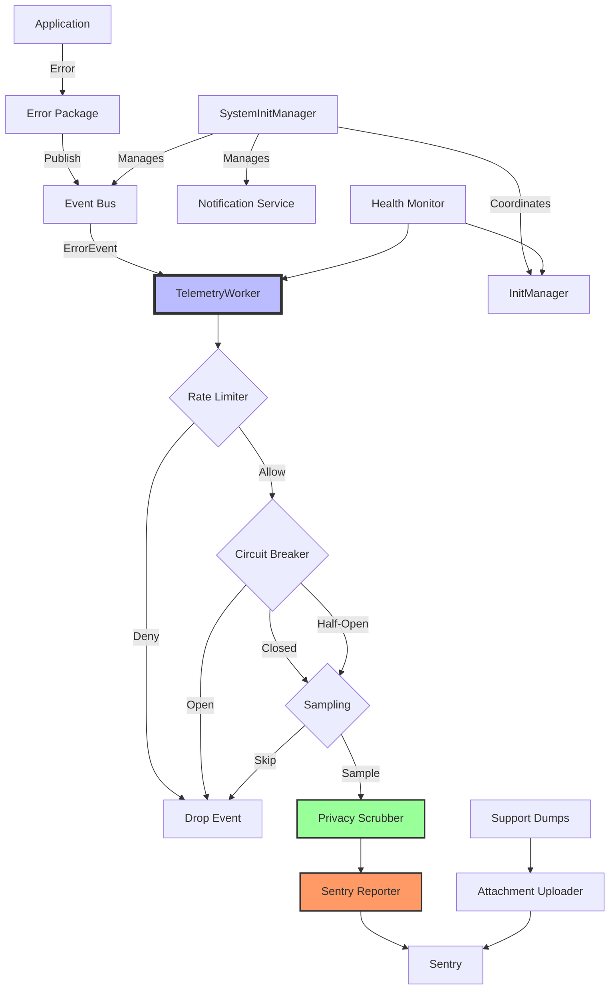

# Telemetry Package

The `telemetry` package provides comprehensive error tracking and telemetry for BirdNET-Go using Sentry integration with asynchronous event processing. This package implements a privacy-first, resilient telemetry system with support for error reporting, support dumps, and system health monitoring.

## Overview

The telemetry system provides:
- **Async error reporting**: Non-blocking Sentry integration via event bus
- **Privacy protection**: Advanced data scrubbing and anonymization
- **Support dumps**: Attachment upload capability for diagnostics
- **Rate limiting**: Configurable limits to prevent overwhelming Sentry
- **Circuit breaker**: Automatic failure recovery with graceful degradation
- **Health monitoring**: Component state tracking and health checks
- **Performance optimization**: Fast-path checking with atomic flags
- **Multi-phase initialization**: Prevents circular dependencies

## Architecture



## Key Components

### SystemInitManager

The top-level initialization coordinator that manages the startup sequence for all async subsystems:
- Coordinates telemetry, notification, and event bus initialization
- Prevents circular dependencies through phased initialization
- Provides system-wide health checks
- Manages graceful shutdown

### InitManager

Manages safe initialization of telemetry components:
- Tracks component states (not_started, in_progress, completed, failed)
- Uses sync.Once for thread-safe initialization
- Provides health checks for individual components
- Handles initialization timeouts and error tracking

### TelemetryWorker

The main event consumer that:
- Implements `EventConsumer` interface for event bus integration
- Processes error events asynchronously
- Manages rate limiting, circuit breaking, and sampling
- Reports to Sentry with privacy protection
- Tracks comprehensive metrics

### Configuration

```go
type WorkerConfig struct {
    // Circuit breaker settings
    FailureThreshold  int           // Default: 10
    RecoveryTimeout   time.Duration // Default: 60s
    HalfOpenMaxEvents int           // Default: 5
    
    // Rate limiting
    RateLimitWindow    time.Duration // Default: 1 minute
    RateLimitMaxEvents int           // Default: 100
    
    // Sampling
    SamplingRate float64 // 0.0-1.0, Default: 1.0 (100%)
    
    // Batching
    BatchingEnabled bool          // Default: true
    BatchSize       int           // Default: 10
    BatchTimeout    time.Duration // Default: 100ms
}
```

### Privacy Protection

The system implements comprehensive privacy protection:

1. **URL Anonymization**
   - URLs are hashed using SHA256
   - Query parameters are removed
   - Path structure is preserved without exposing content

2. **IP Address Categorization**
   - Private IPs: RFC1918 ranges, loopback, link-local
   - Public IPs: Categorized by region when possible
   - Localhost: Special handling for 127.0.0.1

3. **Data Scrubbing**
   - Sensitive patterns removed from messages
   - User data anonymized
   - File paths sanitized

4. **Context Filtering**
   - Only safe context values transmitted
   - PII automatically detected and removed

### Optimized Capture

Fast-path error capture using atomic flags:
- `FastCaptureError()`: Check telemetry state without config lookup
- `FastCaptureMessage()`: Quick message capture
- Automatic state updates on configuration changes
- Test mode support for unit testing

### Attachment Uploader

Support for uploading diagnostic information:
- Upload support dumps as Sentry attachments
- Include system context and user messages
- Dedicated file logging with rotation
- Proper error handling and context cancellation

### Rate Limiting

Window-based rate limiting to protect Sentry quota:
- Sliding window algorithm
- Per-component limits (optional)
- Configurable window and event count
- Metrics tracking for dropped events

### Circuit Breaker

Protects against Sentry outages:
- **States**: 
  - Closed: Normal operation
  - Open: Failing, all events dropped
  - Half-Open: Testing recovery with limited events
- **Failure threshold**: Opens after N consecutive failures
- **Recovery timeout**: Transitions to half-open after timeout
- **Gradual recovery**: Limited events in half-open state

## Initialization

### Multi-Phase Initialization

The system uses a multi-phase initialization approach to prevent circular dependencies:

```go
// Phase 1: Core services (synchronous)
if err := telemetry.InitializeSystem(settings); err != nil {
    return fmt.Errorf("failed to initialize core services: %w", err)
}

// Phase 2: Async services (after core is ready)
if err := telemetry.InitializeAsyncSystems(); err != nil {
    return fmt.Errorf("failed to initialize async services: %w", err)
}
```

### Direct Initialization (Legacy)

```go
// Initialize Sentry first
if err := telemetry.InitSentry(settings); err != nil {
    return fmt.Errorf("failed to init Sentry: %w", err)
}

// Initialize event bus integration
if err := telemetry.InitializeEventBus(); err != nil {
    return fmt.Errorf("failed to init event bus: %w", err)
}
```

### Configuration via Settings

```go
settings := &conf.Settings{
    Sentry: conf.SentrySettings{
        Enabled: true,
        DSN:     "your-sentry-dsn",
        Environment: "production",
        SampleRate: 1.0,
    },
}
```

## Usage

### Health Monitoring

```go
// Get system-wide health status
health := telemetry.GetSystemHealth()
fmt.Printf("System healthy: %v\n", health.Healthy)
for name, subsystem := range health.Subsystems {
    fmt.Printf("%s: %v\n", name, subsystem.Healthy)
}

// Get telemetry-specific stats
worker := telemetry.GetTelemetryWorker()
if worker != nil {
    stats := worker.GetStats()
    fmt.Printf("Events processed: %d\n", stats.EventsProcessed)
    fmt.Printf("Events dropped: %d\n", stats.EventsDropped)
    fmt.Printf("Circuit state: %s\n", stats.CircuitState)
}
```

### Support Dumps

```go
// Upload a support dump
ctx := context.Background()
eventID, err := telemetry.UploadSupportDump(ctx, &telemetry.SupportDumpRequest{
    FilePath:    "/path/to/dump.zip",
    UserMessage: "System crashed during playback",
    SystemID:    "user-system-id",
})
```

### Fast Capture (Performance Optimized)

```go
// Use fast capture for high-frequency code paths
if telemetry.IsTelemetryEnabled() {
    telemetry.FastCaptureError(err)
}

// Or use the convenience method
telemetry.FastCaptureMessage("Important event occurred")
```

## Performance Characteristics

| Metric | Sync (Before) | Async (After) | Improvement |
|--------|---------------|---------------|-------------|
| Error.Build() latency | 100.78ms | 30.77μs | 3,275x |
| CPU usage | High (blocking) | Minimal | Significant |
| Memory usage | Per-error | Batched | Reduced |
| Throughput | Limited | 1000s/sec | 100x+ |
| Fast capture check | N/A | <10ns | Optimal |

## Features

### 1. Privacy Protection
- SHA256 URL anonymization
- IP address categorization
- Sensitive data scrubbing
- Safe context transmission

### 2. Smart Sampling
- Hash-based sampling for consistency
- Component/category-based rules
- Dynamic sampling rate adjustment
- Configurable sample rates

### 3. Health Monitoring
- Component state tracking
- HTTP health check endpoints
- Circuit breaker monitoring
- Performance metrics

### 4. Graceful Degradation
- Circuit breaker prevents cascade failures
- Rate limiting protects Sentry quota
- Event dropping with metrics
- Fallback mechanisms

### 5. Platform Telemetry
- OS and architecture detection
- Container environment detection
- Board model for ARM devices (Raspberry Pi)
- CPU and Go version information

## Testing

### Unit Tests

```bash
# Run telemetry tests
go test ./internal/telemetry/

# With race detection
go test -race ./internal/telemetry/

# Run specific test suites
go test -run TestWorker ./internal/telemetry/
go test -run TestCircuitBreaker ./internal/telemetry/
```

### Benchmarks

```bash
# Run performance benchmarks
go test -bench=. ./internal/telemetry/

# Specific benchmarks
go test -bench=BenchmarkTelemetry ./internal/telemetry/
go test -bench=BenchmarkOptimizedCapture ./internal/telemetry/
go test -bench=BenchmarkDeduplication ./internal/telemetry/
```

### Integration Tests

```bash
# Run end-to-end tests
go test -run TestE2E ./internal/telemetry/

# Test with mock transport
go test -run TestIntegration ./internal/telemetry/
```

### Test Infrastructure

The package includes comprehensive testing support:
- `InitForTesting()`: Sets up mock Sentry transport
- Mock transport with event capture and filtering
- Test helpers for assertion and verification
- Race condition testing with dedicated script
- Benchmark suite for performance validation

## Debugging

### Enable Debug Logging

```go
// Set log level to debug
settings.LogLevel = "debug"

// Or use environment variable
export LOG_LEVEL=debug
```

### Common Issues

1. **Events not reaching Sentry**
   - Check circuit breaker state via health endpoint
   - Verify rate limits aren't exceeded
   - Ensure Sentry DSN is correct
   - Check network connectivity

2. **High memory usage**
   - Adjust batch size in configuration
   - Check event bus buffer size
   - Monitor dropped events rate
   - Review deduplication cache size

3. **Performance degradation**
   - Review sampling rate settings
   - Check worker count configuration
   - Monitor circuit breaker trips
   - Analyze rate limiter metrics

4. **Initialization failures**
   - Check for circular dependencies
   - Verify initialization order
   - Review error logs for details
   - Use health checks to diagnose

## Best Practices

1. **Initialize Early**: Set up telemetry during application startup
2. **Configure Rate Limits**: Based on your Sentry quota and traffic
3. **Monitor Health**: Use health endpoints in production
4. **Use Fast Capture**: For high-frequency code paths
5. **Set Sampling Rates**: Balance visibility with quota usage
6. **Handle Failures**: Check return values and log errors
7. **Test with Mocks**: Use test helpers for unit testing
8. **Review Privacy**: Ensure sensitive data is scrubbed

## Environment Variables

| Variable | Description | Default |
|----------|-------------|---------|
| `SENTRY_DSN` | Sentry DSN | - |
| `SENTRY_ENVIRONMENT` | Environment name | "production" |
| `SENTRY_SAMPLE_RATE` | Sample rate (0.0-1.0) | 1.0 |
| `SENTRY_DEBUG` | Enable debug mode | false |
| `LOG_LEVEL` | Logging level | "info" |

## File Structure

```
telemetry/
├── README.md                    # This file
├── worker.go                    # Main telemetry worker
├── sentry.go                   # Sentry integration
├── optimized_capture.go        # Fast-path capture
├── attachments.go              # Support dump handling
├── deferred_init.go            # Deferred initialization
├── init_manager.go             # Component initialization
├── system_init_manager.go      # System-wide coordination
├── error_integration.go        # Error package integration
├── eventbus_integration.go     # Event bus integration
├── health.go                   # Health monitoring
├── test_helpers.go             # Testing utilities
├── mock_transport.go           # Mock Sentry transport
└── logs/                       # Runtime logs
    ├── telemetry.log          # Service logs
    ├── events.log             # Event logs
    └── notifications.log      # Notification logs
```

## Future Enhancements

1. **Metrics Export**: Additional metrics export capabilities
2. **Dynamic Configuration**: Hot-reload of settings
3. **Advanced Sampling**: ML-based importance scoring
4. **Distributed Tracing**: Full trace context support
5. **Custom Transports**: Pluggable backend support
6. **Event Replay**: Store and replay failed events
7. **Dashboard Integration**: Real-time monitoring UI