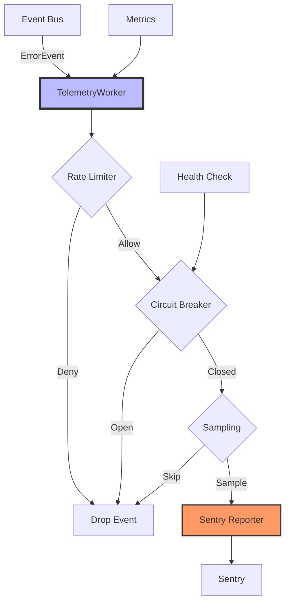

# Telemetry Package

The `telemetry` package provides Sentry integration for BirdNET-Go with async event processing via the event bus system. This package implements the telemetry consumer for the async event system (issue #833).

## Overview

The telemetry system provides:
- **Async error reporting**: Non-blocking Sentry integration
- **Rate limiting**: Configurable limits to prevent overwhelming Sentry
- **Circuit breaker**: Automatic failure recovery
- **Privacy protection**: Sensitive data scrubbing
- **Performance monitoring**: Track telemetry overhead

## Architecture



## Key Components

### TelemetryWorker

The main event consumer that:
- Implements `EventConsumer` interface
- Processes error events from the event bus
- Manages rate limiting and circuit breaking
- Reports to Sentry asynchronously

### Configuration

```go
type WorkerConfig struct {
    // Circuit breaker settings
    FailureThreshold  int           // Default: 10
    RecoveryTimeout   time.Duration // Default: 60s
    HalfOpenMaxEvents int           // Default: 5
    
    // Rate limiting
    RateLimitWindow    time.Duration // Default: 1 minute
    RateLimitMaxEvents int           // Default: 100
    
    // Sampling
    SamplingRate float64 // 0.0-1.0, Default: 1.0 (100%)
    
    // Batching
    BatchingEnabled bool          // Default: true
    BatchSize       int           // Default: 10
    BatchTimeout    time.Duration // Default: 100ms
}
```

### Rate Limiting

Prevents overwhelming Sentry with too many events:
- **Window-based**: Sliding window algorithm
- **Per-component**: Optional component-based limits
- **Configurable**: Adjust based on Sentry quota

### Circuit Breaker

Protects against Sentry outages:
- **States**: Closed (normal), Open (failing), Half-Open (testing)
- **Failure threshold**: Opens after N consecutive failures
- **Recovery timeout**: Transitions to half-open after timeout
- **Gradual recovery**: Limited events in half-open state

## Usage

### Initialization

```go
// Initialize Sentry first
if err := telemetry.InitSentry(settings); err != nil {
    // Using fmt.Errorf here is intentional - this is initialization
    // code where the enhanced error system may not be ready yet
    return fmt.Errorf("failed to init Sentry: %w", err)
}

// Event bus integration is automatic via InitSentry
// The TelemetryWorker is registered as a consumer
```

### Configuration via Settings

```go
settings := &conf.Settings{
    Sentry: conf.SentrySettings{
        Enabled: true,
        DSN:     "your-sentry-dsn",
        Environment: "production",
        SampleRate: 1.0,
    },
}
```

### Monitoring

```go
// Get telemetry worker stats
worker := telemetry.GetTelemetryWorker()
if worker != nil {
    stats := worker.GetStats()
    fmt.Printf("Events processed: %d\n", stats.EventsProcessed)
    fmt.Printf("Events dropped: %d\n", stats.EventsDropped)
    fmt.Printf("Circuit state: %s\n", stats.CircuitState)
}
```

## Performance Characteristics

| Metric | Before (Sync) | After (Async) | Improvement |
|--------|---------------|---------------|-------------|
| Error.Build() latency | 100.78ms | 30.77μs | 3,275x |
| CPU usage | High (blocking) | Minimal | Significant |
| Memory usage | Per-error | Batched | Reduced |
| Throughput | Limited | 1000s/sec | 100x+ |

## Features

### 1. Privacy Protection

- Automatic scrubbing of sensitive data
- Configurable patterns for PII detection
- Safe context data transmission

### 2. Smart Sampling

- Hash-based sampling for consistency
- Component/category-based rules
- Configurable sample rates

### 3. Health Monitoring

- HTTP health check endpoint
- Circuit breaker state monitoring
- Performance metrics tracking

### 4. Graceful Degradation

- Circuit breaker prevents cascade failures
- Rate limiting protects Sentry quota
- Event dropping with metrics

## Integration with Event Bus

The telemetry package integrates seamlessly with the event bus:

1. **Registration**: Automatically registered during `InitSentry()`
2. **Event Processing**: Receives `ErrorEvent` instances
3. **Async Processing**: Non-blocking error reporting
4. **Deduplication**: Leverages event bus deduplication

## Testing

### Unit Tests

```bash
# Run telemetry tests
go test ./internal/telemetry/

# With race detection
go test -race ./internal/telemetry/
```

### Benchmarks

```bash
# Run performance benchmarks
go test -bench=. ./internal/telemetry/

# Specific benchmarks
go test -bench=BenchmarkTelemetry ./internal/telemetry/
```

### Integration Tests

The package includes comprehensive integration tests:
- Mock Sentry transport for testing
- Circuit breaker behavior validation
- Rate limiter verification
- End-to-end event flow testing

## Debugging

### Enable Debug Logging

```go
// Set log level to debug
settings.LogLevel = "debug"
```

### Common Issues

1. **Events not reaching Sentry**
   - Check circuit breaker state
   - Verify rate limits
   - Ensure Sentry DSN is correct

2. **High memory usage**
   - Adjust batch size
   - Check event bus buffer size
   - Monitor dropped events

3. **Performance degradation**
   - Review sampling rate
   - Check worker count
   - Monitor circuit breaker trips

## Best Practices

1. **Configure rate limits**: Based on your Sentry quota
2. **Monitor circuit breaker**: Track failure patterns
3. **Use sampling**: For high-volume environments
4. **Set appropriate timeouts**: Balance reliability and performance
5. **Monitor metrics**: Track dropped events and failures

## Environment Variables

| Variable | Description | Default |
|----------|-------------|---------|
| `SENTRY_DSN` | Sentry DSN | - |
| `SENTRY_ENVIRONMENT` | Environment name | "production" |
| `SENTRY_SAMPLE_RATE` | Sample rate (0.0-1.0) | 1.0 |
| `SENTRY_DEBUG` | Enable debug mode | false |

## Future Enhancements

1. **Dynamic rate limiting**: Adjust based on quota usage
2. **Smart batching**: Optimize batch sizes dynamically
3. **Enhanced sampling**: ML-based importance scoring
4. **Metrics export**: Prometheus/OpenTelemetry integration
5. **Replay capability**: Store and replay failed events